# Plan — v0.2.0 Trust Closure & v0.3.0 Scoping

**Created:** 2026-07-19 04:49 CEST
**Author:** Crush (glm-5.2), prompted by Lars
**Status:** Proposed (awaiting approval to execute)
**Scope:** Close out v0.2.0 debt honestly, decide v0.3.0 scope, install process fixes that prevent the failures of the last 3 sessions.

---

## Context (read this first)

`segment-buffer` v0.2.0 was cut at `fe81dd2` and is on `origin/master`. Three same-day sessions (`522de63` multi-skill, `e09f84c` superb-tier, `fe81dd2` v0.2.0 sweep) plus a docs sweep (`e15c0b6`) and a historical-doc format pass (`b1b87ea`) produced ~100 TODOs across 3 self-review reports. The self-reviews are brutally honest; the debt is real; the process that produced it was sloppy.

### Critical correction to the historical record

Three self-reports (`03-14 §d.7`, `04-22 §d.2`, and the 04-40 docs-health self-review) blame a "Crush auto-staging/auto-commit hook" for unexpected working-tree state. **Investigation during this planning session found no such hook exists.** The only crush hook is `/home/lars/.config/crush/hooks/commit-diff-context.sh`, which fires _when a commit runs_ to inject staged-diff context — it does not stage or commit on its own. Git timestamps confirm every commit was made in-session by the assistant.

**The "auto-hook" was misattribution.** The assistant committed its own work and lost track. The fix is not "disable a hook" — it is "the assistant must run `git status` + `git log` before any closing claim about working-tree state." This plan corrects the record and installs the rule.

### The three pending user decisions (still open from §g)

1. **Fuzz CI cadence** — required-on-PR / nightly / manual / out-of-CI?
2. **v0.3.0 scope/timing** — start now / wait for users / minimal (non_exhaustive only)?
3. **The "auto-staging hook" question** — MOOT. No hook exists. The real question is: "should the assistant's session-end protocol mandate `git status` + `git log` verification?"

This plan proceeds on conservative assumptions where decisions are pending, and flags them.

---

## Pareto analysis

**Goal:** Convert v0.2.0 from "shipped but half-proven" to "shipped and fully trusted," pay down the semver debt introduced in v0.2.0, and install process fixes that prevent recurrence — all without Verschlimmbesserung.

### The 1% that delivers 51%

**Run the verification gate locally.** Four commands: `cargo +1.85 check`, `cargo test --features encryption`, `cargo clippy --all-targets --features encryption -- -D warnings`, `cargo doc --no-deps --features encryption`. Every claim in README/CHANGELOG/FEATURES (test counts, MSRV, "code is green") rests on this. Without it, the docs are marketing. ~15 minutes of work that grounds every subsequent claim.

### The 4% that delivers 64%

**Verification gate + `#[non_exhaustive]` on `BufferStats` and `SegmentConfig` + `Debug` impl for `SegmentBuffer<T>`.** The non_exhaustive sweeps pay down the v0.2.0-introduced semver debt. The `Debug` impl is a standard ergonomic missing from v0.2.0. Together with the verification gate, this closes "v0.2.0 is trustworthy and complete." Because non_exhaustive is breaking, this batch implies a v0.3.0 cut.

### The 20% that delivers 80%

**All P0 items from the self-reviews:**

- Verification gate (1%)
- non_exhaustive sweeps + Debug impl (the other 3% of the 4%)
- Real fuzz run via Nix nightly
- `CipherError::with_source` doc-test
- Snapshot/golden tests for error Display
- `PROPTEST_CASES=256` pin in CI
- `stats()` bench (prove or remove the "cheaper" claim)
- Honest "no controlled baseline" framing in README/CHANGELOG
- Process fixes (verify-before-claiming rule, session-end checklist)
- Correct the "auto-hook" myth in the 3 self-reports

After Phase 1-4 of this plan, v0.2.0 (or its v0.3.0 successor) is genuinely shippable with no known debt carried forward.

### The other 20% (to reach 100%)

Everything else in TODO_LIST.md: the larger v0.3.0 breaking batch (builder, Duration, RecoveryReport, FlushPolicy, typed Io, SegmentAead rename), concurrency depth (Loom), performance work (lending iterator, atomic bytes, scan cache), observability (tracing fields, examples), Nix tooling (CI workflow, MSRV pin, macOS verify), polish (README-in-lib, doc-tests-per-method, semver policy doc), and investigations (`T: 'static`, AES extraction, Nix build profiling).

---

## Comprehensive plan (30–100 min per task)

All 35 tasks cover every TODO in TODO_LIST.md plus the process fixes. Sorted within phase by impact/effort ratio. Phases are ordered by dependency: each phase's outputs unblock the next.

| ID  | Phase     | Task                                                                                                                             | Impact | Effort (min) | Customer value                                   | Depends on |
| --- | --------- | -------------------------------------------------------------------------------------------------------------------------------- | ------ | ------------ | ------------------------------------------------ | ---------- |
| T1  | 1-Verify  | Run full verification gate locally (fmt, clippy×2, test×2, doc, examples)                                                        | 10     | 30           | Trust foundation                                 | —          |
| T2  | 1-Verify  | Install Rust 1.85 via Nix overlay; run `cargo +1.85 check --all-targets --features encryption`; fix breaks                       | 9      | 60           | MSRV claim becomes honest                        | T1         |
| T3  | 1-Verify  | Install nightly via Nix; run `cargo +nightly fuzz` ≥60s per target; triage crashes                                               | 9      | 90           | Fuzz claim becomes honest                        | T1         |
| T4  | 2-Debt    | Add `#[non_exhaustive]` to `BufferStats` (src/lib.rs:95) and `SegmentConfig`                                                     | 8      | 30           | Semver hygiene (v0.2.0 debt)                     | T1         |
| T5  | 2-Debt    | Add `Debug` impl for `SegmentBuffer<T>`                                                                                          | 7      | 30           | Standard ergonomics                              | T1         |
| T6  | 2-Debt    | Add doc-test for `CipherError::with_source` (src/cipher.rs:66)                                                                   | 7      | 30           | Doc completeness                                 | T1         |
| T7  | 2-Debt    | Snapshot/golden tests for `SegmentError` and `CipherError` Display                                                               | 6      | 45           | Lock format strings                              | T1         |
| T8  | 2-Debt    | Bench `stats()` vs individual accessors; prove or remove "cheaper" claim                                                         | 5      | 30           | Honest doc claims                                | T1         |
| T9  | 3-Honesty | Update README/CHANGELOG "no regression" → "no controlled baseline available"                                                     | 8      | 30           | Stop lying                                       | T1         |
| T10 | 3-Honesty | Capture controlled baseline (checkout v0.1.0, bench, compare) OR formally accept "no baseline"                                   | 6      | 60           | Prove or kill the claim                          | T1         |
| T11 | 3-Honesty | Pin `PROPTEST_CASES=256` in `.github/workflows/ci.yml`                                                                           | 6      | 30           | Anti-flakiness                                   | —          |
| T12 | 4-Process | Add "verify before claiming" rule + session-end checklist to AGENTS.md                                                           | 9      | 45           | Prevents recurrence of 3-session failure pattern | —          |
| T13 | 4-Process | Correct the "auto-staging hook" myth in 3 self-reports; reframe as "lost track of own commits"                                   | 7      | 30           | Historical-record honesty                        | —          |
| T14 | 5-Release | Minimal v0.3.0 cut: T4+T5+T6 batched, CHANGELOG entry, version bump, tag                                                         | 8      | 60           | Get debt into a release                          | T4, T5, T6 |
| T15 | 5-Release | Decide larger v0.3.0 scope; defer builder/Duration/RecoveryReport/FlushPolicy/typed-Io/SegmentAead to v0.4.0 unless user objects | 5      | 30           | Prevent scope creep                              | T14        |
| T16 | 6-Trust   | Loom concurrency test for `append`/`flush`/`delete_acked`/`recover`                                                              | 8      | 90           | Prove MPMC invariant across all schedules        | T1         |
| T17 | 6-Trust   | Nix fuzz app (`apps.fuzz`) for reproducible local fuzzing                                                                        | 5      | 45           | Reproducibility                                  | T3         |
| T18 | 6-Trust   | Add markdown link checker (lychee) to CI; fix any broken links                                                                   | 5      | 45           | Anti-rot                                         | —          |
| T19 | 7-Docs    | `#![doc = include_str!("../README.md")]` on crate root; clean README code blocks for rustdoc                                     | 6      | 90           | docs.rs landing page                             | T1         |
| T20 | 7-Docs    | Doc-test coverage for every public method (currently 15; goal ~30)                                                               | 5      | 90           | Discoverability                                  | T1         |
| T21 | 7-Docs    | Semver/stability policy doc (CONTRIBUTING or `docs/policies.md`); include non_exhaustive rule                                    | 5      | 45           | Prevent future semver debt                       | T12        |
| T22 | 8-v0.4    | `SegmentConfig::builder()` with defaults                                                                                         | 7      | 90           | Ergonomic, non-breaking growth                   | T14        |
| T23 | 8-v0.4    | `flush_interval: Duration` instead of `flush_interval_secs: u64`                                                                 | 5      | 45           | Idiomatic API                                    | T14        |
| T24 | 8-v0.4    | `RecoveryReport` returned from `open()`                                                                                          | 6      | 60           | Programmatic recovery introspection              | T14        |
| T25 | 8-v0.4    | `FlushPolicy` enum (Batch / Interval / Manual)                                                                                   | 5      | 60           | Replaces silently-combining fields               | T14        |
| T26 | 8-v0.4    | Typed `SegmentError::Io` with path context                                                                                       | 6      | 45           | Diagnostic quality                               | T14        |
| T27 | 8-v0.4    | Consider `SegmentCipher` → `SegmentAead` rename (decision + impl or reject)                                                      | 3      | 45           | Naming honesty                                   | T14        |
| T28 | 9-Perf    | `read_from` clone quantification + `for_each_from(start, limit, F)` lending iterator                                             | 6      | 90           | Zero-clone reads                                 | T1         |
| T29 | 9-Perf    | `AtomicU64` for `approx_disk_bytes`; removes second lock in `flush()`                                                            | 4      | 45           | Throughput                                       | T1         |
| T30 | 9-Perf    | Cache `scan_segments()` across calls within TTL                                                                                  | 4      | 60           | Throughput                                       | T1         |
| T31 | 10-Ops    | Crash-recovery example (`examples/crash_recovery.rs`)                                                                            | 5      | 45           | Demonstrate durability contract                  | T1         |
| T32 | 10-Ops    | MPMC example (`examples/mpmc.rs`)                                                                                                | 4      | 45           | Demonstrate MPMC                                 | T1         |
| T33 | 10-Ops    | `tracing` field standardization (path, seq, bytes on every event)                                                                | 4      | 60           | Operational observability                        | —          |
| T34 | 10-Ops    | Nix CI workflow (`.github/workflows/nix.yml`) mirroring `nix flake check`                                                        | 4      | 45           | Reproducible CI                                  | —          |
| T35 | 10-Ops    | cargo-deny + Renovate/dependabot + cargo-release configs                                                                         | 3      | 60           | Supply-chain hygiene                             | —          |

**Phase totals:**

- Phase 1 (Verify): 3 tasks, 180 min
- Phase 2 (Debt): 5 tasks, 165 min
- Phase 3 (Honesty): 3 tasks, 120 min
- Phase 4 (Process): 2 tasks, 75 min
- Phase 5 (Release): 2 tasks, 90 min
- Phase 6 (Trust): 3 tasks, 180 min
- Phase 7 (Docs): 3 tasks, 225 min
- Phase 8 (v0.4 API): 6 tasks, 330 min
- Phase 9 (Perf): 3 tasks, 195 min
- Phase 10 (Ops): 4 tasks, 210 min

**Grand total: ~1,770 min (~30 hours of work).**

### Deferred / out-of-scope (ROADMAP, not TODO_LIST)

These remain in ROADMAP.md and are NOT in this plan: per-segment Blake3 checksum, envelope v2 design doc, compression-algorithm negotiation, metadata block in envelope, `SegmentStore` trait, async I/O feature, ChaCha20-Poly1305 ciphers, profile-guided optimization, `T: 'static` investigation, AES extraction, Nix build profiling, MSRV pin in flake (T2 supersedes for now), macOS flake verification, skill-contract HTML artifacts (renegotiate separately).

---

## Sub-task breakdown (≤12 min per task)

Every task above decomposed into atomic sub-tasks. Sorted by dependency order, then impact. Each sub-task is sized to fit a single focused work unit.

### Phase 1 — Verify v0.2.0 (T1, T2, T3)

| Sub-ID | Parent | Sub-task                                                                                          | Effort (min) |
| ------ | ------ | ------------------------------------------------------------------------------------------------- | ------------ |
| S1.1   | T1     | `cargo fmt --all -- --check` — confirm clean                                                      | 2            |
| S1.2   | T1     | `cargo clippy --all-targets -- -D warnings` — confirm clean                                       | 4            |
| S1.3   | T1     | `cargo clippy --all-targets --features encryption -- -D warnings` — confirm clean                 | 5            |
| S1.4   | T1     | `cargo test --no-fail-fast` — capture count, confirm 32 unit + 15 doc pass                        | 8            |
| S1.5   | T1     | `cargo test --no-fail-fast --features encryption` — capture count, confirm 40 unit + 15 doc pass  | 10           |
| S1.6   | T1     | `RUSTDOCFLAGS="-D warnings" cargo doc --no-deps --features encryption` — confirm clean            | 8            |
| S1.7   | T1     | `cargo run --example basic_usage` and `cargo run --example backpressure` — confirm output         | 5            |
| S1.8   | T1     | `cargo run --example encrypted --features encryption` — confirm output                            | 5            |
| S1.9   | T1     | Verify actual unit-test count via `grep -c '#\[test\]' src/*.rs`; reconcile with FEATURES.md      | 4            |
| S1.10  | T1     | Verify doc-test count via `cargo test --doc --features encryption -- --list \| wc -l`; reconcile  | 6            |
| S1.11  | T1     | Verify property count via `grep -c 'proptest!' src/property_tests.rs`; reconcile with FEATURES.md | 2            |
| S2.1   | T2     | Add `rust-overlay` input to `flake.nix` from `github:oxalica/rust-overlay`                        | 8            |
| S2.2   | T2     | Add Rust 1.85 toolchain to devShell as `rust_1_85_0` overlay                                      | 10           |
| S2.3   | T2     | `nix flake check --no-build` — confirm flake parses                                               | 4            |
| S2.4   | T2     | `nix develop -c cargo +1.85.0 check --all-targets --features encryption`                          | 10           |
| S2.5   | T2     | If 1.85 fails: triage root cause (likely `ErrorExt` upcast or `const fn` assertion)               | 12           |
| S2.6   | T2     | Fix any MSRV break; re-run S2.4 until clean                                                       | 12           |
| S2.7   | T2     | Update AGENTS.md MSRV note: "verified locally via Nix 1.85 overlay"                               | 4            |
| S3.1   | T3     | Add nightly toolchain to flake via overlay (`rust-bin.nightly.latest.minimal`)                    | 8            |
| S3.2   | T3     | `nix develop -c cargo +nightly fuzz run fuzz_corrupted_read -- -max_total_time=60`                | 12           |
| S3.3   | T3     | `nix develop -c cargo +nightly fuzz run fuzz_recovery -- -max_total_time=60`                      | 12           |
| S3.4   | T3     | If crashes: capture reproducer, add regression test in `src/tests.rs`, fix root cause             | 12           |
| S3.5   | T3     | Update FEATURES.md fuzz row: "PARTIALLY_FUNCTIONAL → executed locally; CI integration TBD"        | 4            |

### Phase 2 — Pay down v0.2.0 debt (T4, T5, T6, T7, T8)

| Sub-ID | Parent | Sub-task                                                                                               | Effort (min) |
| ------ | ------ | ------------------------------------------------------------------------------------------------------ | ------------ |
| S4.1   | T4     | Add `#[non_exhaustive]` to `BufferStats` (src/lib.rs:94)                                               | 2            |
| S4.2   | T4     | Add `#[non_exhaustive]` to `SegmentConfig` (find struct def)                                           | 2            |
| S4.3   | T4     | `cargo check --features encryption` — confirm no in-crate breaks                                       | 3            |
| S4.4   | T4     | `cargo test --features encryption` — confirm no test breaks (external construction sites)              | 8            |
| S4.5   | T4     | Update doc comments on both structs noting `#[non_exhaustive]` construction rules                      | 6            |
| S5.1   | T5     | Add `impl<T: fmt::Debug> fmt::Debug for SegmentBuffer<T>` mirroring `BufferStats` field set            | 10           |
| S5.2   | T5     | Add `#[test] fn debug_impl_formats_cleanly()` snapshot test                                            | 6            |
| S5.3   | T5     | `cargo test --features encryption` — confirm pass                                                      | 5            |
| S6.1   | T6     | Read `CipherError::with_source` (src/cipher.rs:66) for exact signature                                 | 2            |
| S6.2   | T6     | Write doc-test: construct a `CipherError::with_source` from a typed error; assert `source().is_some()` | 8            |
| S6.3   | T6     | `cargo test --doc --features encryption -- with_source` — confirm pass                                 | 3            |
| S7.1   | T7     | Add `insta` snapshot dep (or hand-rolled `assert_eq!` on `format!("{e}")`)                             | 8            |
| S7.2   | T7     | Write snapshot cases: each `SegmentError` variant × each `CipherError` constructor                     | 12           |
| S7.3   | T7     | `cargo test --features encryption` — confirm pass; commit snapshot files                               | 8            |
| S8.1   | T8     | Write criterion micro-bench: `stats()` vs `pending_count()+latest_sequence()+store_pressure()`         | 10           |
| S8.2   | T8     | Run bench; capture numbers                                                                             | 8            |
| S8.3   | T8     | If claim holds: cite numbers in doc comment. If not: weaken/remove "cheaper" claim                     | 6            |

### Phase 3 — Honesty (T9, T10, T11)

| Sub-ID | Parent | Sub-task                                                                                                         | Effort (min) |
| ------ | ------ | ---------------------------------------------------------------------------------------------------------------- | ------------ |
| S9.1   | T9     | Read README.md "Status" section and CHANGELOG `[0.2.0]` Security/Changed sections                                | 3            |
| S9.2   | T9     | Rewrite README "no regression" → "absolute throughput X; no controlled pre-envelope baseline"                    | 6            |
| S9.3   | T9     | Add matching caveat to CHANGELOG `[0.2.0]`                                                                       | 4            |
| S10.1  | T10    | `git worktree add ../sb-baseline v0.1.0` (or similar isolated checkout)                                          | 6            |
| S10.2  | T10    | In baseline worktree: `cargo bench --bench bench_append -- --warm-up-time 1 --measurement-time 3`                | 8            |
| S10.3  | T10    | In baseline worktree: `cargo bench --bench bench_recover -- --warm-up-time 1 --measurement-time 3`               | 8            |
| S10.4  | T10    | On HEAD: re-run the same benches with same flags                                                                 | 10           |
| S10.5  | T10    | Compute percentage delta; record in `docs/perf/v0.1.0-vs-v0.2.0.md`                                              | 10           |
| S10.6  | T10    | If delta < 5%: update README/CHANGELOG with "≤X% regression vs v0.1.0 controlled baseline". If > 5%: investigate | 10           |
| S10.7  | T10    | `git worktree remove ../sb-baseline`                                                                             | 2            |
| S11.1  | T11    | Read `.github/workflows/ci.yml`                                                                                  | 4            |
| S11.2  | T11    | Add `env: PROPTEST_CASES: 256` to the test job steps                                                             | 4            |
| S11.3  | T11    | Confirm CI yaml lints; commit                                                                                    | 4            |

### Phase 4 — Process fixes (T12, T13)

| Sub-ID | Parent | Sub-task                                                                                                                | Effort (min) |
| ------ | ------ | ----------------------------------------------------------------------------------------------------------------------- | ------------ |
| S12.1  | T12    | Draft "Verify before claiming" rule (covers working-tree state, test counts, link integrity, health scores, citations)  | 10           |
| S12.2  | T12    | Draft "Session-end checklist" (git status, git log, verification gate, score formula, citation re-check, link check)    | 10           |
| S12.3  | T12    | Add both to AGENTS.md under new "Verification discipline" section                                                       | 8            |
| S12.4  | T12    | Add rule: "Never describe working-tree state without a fresh `git status` in the same message"                          | 3            |
| S12.5  | T12    | Add rule: "Never invent baselines (health scores, perf numbers) — say 'first audit' or 'no baseline' instead"           | 3            |
| S12.6  | T12    | Add rule: "Line-number citations banned; cite section names or item text"                                               | 3            |
| S12.7  | T12    | Commit AGENTS.md update                                                                                                 | 2            |
| S13.1  | T13    | For each of 3 self-reports: locate "auto-staging/auto-commit hook" claim                                                | 6            |
| S13.2  | T13    | Add inline correction: "Update 2026-07-19: investigation found no such hook; commits were in-session and lost track of" | 10           |
| S13.3  | T13    | Update §g Q2 in each self-report: reframe as "process fix needed, not hook disable"                                     | 8            |
| S13.4  | T13    | Commit historical-doc corrections                                                                                       | 2            |

### Phase 5 — Release (T14, T15)

| Sub-ID | Parent | Sub-task                                                                                                                                    | Effort (min) |
| ------ | ------ | ------------------------------------------------------------------------------------------------------------------------------------------- | ------------ |
| S14.1  | T14    | Bump `Cargo.toml` version `0.2.0 → 0.3.0`                                                                                                   | 2            |
| S14.2  | T14    | Add CHANGELOG `[0.3.0]` section: Added (Debug impl, with_source doc-test), Changed (non_exhaustive on BufferStats/SegmentConfig — breaking) | 10           |
| S14.3  | T14    | Update README Status section; FEATURES.md status rows                                                                                       | 8            |
| S14.4  | T14    | Update AGENTS.md envelope section if needed                                                                                                 | 4            |
| S14.5  | T14    | Run full verification gate (T1 sub-tasks)                                                                                                   | 12           |
| S14.6  | T14    | `git tag v0.3.0` (do NOT push tag without user approval)                                                                                    | 2            |
| S15.1  | T15    | Draft recommendation: defer builder/Duration/RecoveryReport/FlushPolicy/typed-Io/SegmentAead to v0.4.0                                      | 10           |
| S15.2  | T15    | Add v0.4.0 section to TODO_LIST.md; move 6 items there                                                                                      | 8            |
| S15.3  | T15    | Update ROADMAP.md "Direction" to reflect v0.4.0 batching                                                                                    | 6            |

### Phase 6 — Trust depth (T16, T17, T18)

| Sub-ID | Parent | Sub-task                                                                                           | Effort (min) |
| ------ | ------ | -------------------------------------------------------------------------------------------------- | ------------ |
| S16.1  | T16    | Add `loom` dev-dependency with `cfg(loom)` feature pattern                                         | 8            |
| S16.2  | T16    | Write Loom test scaffold in `src/loom_tests.rs` covering `append`/`flush`/`delete_acked`/`recover` | 12           |
| S16.3  | T16    | Run under `RUSTFLAGS="--cfg loom" cargo test --test loom`                                          | 8            |
| S16.4  | T16    | If races: fix root cause; re-run until clean across 10K schedules                                  | 12           |
| S17.1  | T17    | Add `apps.fuzz.<target>` to `flake.nix` invoking nightly fuzz                                      | 10           |
| S17.2  | T17    | Document in fuzz/README.md and AGENTS.md                                                           | 4            |
| S18.1  | T18    | Add `lychee` config (`.github/lychee.toml`)                                                        | 6            |
| S18.2  | T18    | Run `lychee *.md docs/**/*.md`; fix any broken links                                               | 10           |
| S18.3  | T18    | Add link-check job to CI workflow                                                                  | 8            |

### Phase 7 — Docs polish (T19, T20, T21)

| Sub-ID | Parent | Sub-task                                                                                                          | Effort (min) |
| ------ | ------ | ----------------------------------------------------------------------------------------------------------------- | ------------ |
| S19.1  | T19    | Audit README.md code blocks; mark non-rust blocks as `text`                                                       | 8            |
| S19.2  | T19    | Add `#![doc = include_str!("../README.md")]` to crate root (src/lib.rs:1)                                         | 4            |
| S19.3  | T19    | `cargo doc --no-deps --features encryption`; fix any rustdoc warnings                                             | 12           |
| S20.1  | T20    | Inventory public methods without doc-tests (`grep -B2 'pub fn' src/*.rs`)                                         | 8            |
| S20.2  | T20    | Write doc-test for each (target ~15 new tests)                                                                    | 12 × N       |
| S20.3  | T20    | `cargo test --doc --features encryption`; confirm all pass                                                        | 8            |
| S21.1  | T21    | Draft semver policy: breaking change triggers version bump, `#[non_exhaustive]` default, source() chains required | 10           |
| S21.2  | T21    | Add to CONTRIBUTING.md or create `docs/policies.md`                                                               | 8            |

### Phase 8 — v0.4.0 API batch (T22–T27)

Each task decomposes into: design (5) + impl (10) + tests (10) + docs (5) + verify (5). Pattern shown for T22; repeat for T23–T27.

| Sub-ID  | Parent | Sub-task                                                                        | Effort (min) |
| ------- | ------ | ------------------------------------------------------------------------------- | ------------ |
| S22.1   | T22    | Design `SegmentConfig::builder()` API (default + setters)                       | 8            |
| S22.2   | T22    | Implement builder; deprecate direct construction gently                         | 12           |
| S22.3   | T22    | Tests: builder produces equivalent config; doc-test                             | 10           |
| S22.4   | T22    | Docs: update README/AGENTS/examples to use builder                              | 8            |
| S23.1–4 | T23    | Same pattern: `flush_interval: Duration`                                        | 4×8          |
| S24.1–4 | T24    | Same pattern: `RecoveryReport` from `open()`                                    | 4×10         |
| S25.1–4 | T25    | Same pattern: `FlushPolicy` enum                                                | 4×10         |
| S26.1–4 | T26    | Same pattern: typed `SegmentError::Io`                                          | 4×8          |
| S27.1–4 | T27    | Same pattern: `SegmentCipher` → `SegmentAead` rename (or reject with rationale) | 4×8          |

### Phase 9 — Performance (T28, T29, T30)

| Sub-ID | Parent | Sub-task                                                                  | Effort (min) |
| ------ | ------ | ------------------------------------------------------------------------- | ------------ |
| S28.1  | T28    | Bench current `read_from` clone cost at N=1000, 10000                     | 8            |
| S28.2  | T28    | Design `for_each_from(start, limit, F)` lending API                       | 10           |
| S28.3  | T28    | Implement; bench delta                                                    | 12           |
| S29.1  | T29    | Change `approx_disk_bytes: u64` → `AtomicU64` in `BufferInner`            | 8            |
| S29.2  | T29    | Update all access sites; remove second lock in `flush()`                  | 10           |
| S29.3  | T29    | Tests + benches                                                           | 12           |
| S30.1  | T30    | Add segment-list cache to `BufferInner` with directory mtime invalidation | 12           |
| S30.2  | T30    | Bench `read_from`/`delete_acked` delta                                    | 8            |

### Phase 10 — Ops (T31–T35)

| Sub-ID | Parent | Sub-task                                                                 | Effort (min) |
| ------ | ------ | ------------------------------------------------------------------------ | ------------ |
| S31.1  | T31    | Write `examples/crash_recovery.rs` showing mid-flush crash + recovery    | 12           |
| S31.2  | T31    | Run; verify output; add to README "How it works"                         | 6            |
| S32.1  | T32    | Write `examples/mpmc.rs` with 4 writers + 1 reader                       | 12           |
| S33.1  | T33    | Audit `tracing::` calls; add `path`, `seq`, `bytes` fields where missing | 12           |
| S34.1  | T34    | Create `.github/workflows/nix.yml` mirroring `nix flake check`           | 10           |
| S35.1  | T35    | Add `deny.toml` for cargo-deny; run; fix advisories                      | 10           |
| S35.2  | T35    | Add `renovate.json` or `.github/dependabot.yml`                          | 6            |
| S35.3  | T35    | Add `cargo-release` config (`release.toml`)                              | 6            |

**Sub-task grand total: ~1,770 min (~30 hours), matching the comprehensive plan.**

---

## Execution graph

```mermaid
graph TD
    Start([Start])

    subgraph P1[Phase 1 — Verify v0.2.0]
        T1[T1: Verification gate<br/>fmt/clippy/test/doc]
        T2[T2: MSRV 1.85 via Nix overlay]
        T3[T3: Real fuzz via Nix nightly]
    end

    subgraph P2[Phase 2 — Pay down v0.2.0 debt]
        T4[T4: non_exhaustive<br/>BufferStats + SegmentConfig]
        T5[T5: Debug impl for SegmentBuffer]
        T6[T6: with_source doc-test]
        T7[T7: Snapshot tests for Display]
        T8[T8: stats bench]
    end

    subgraph P3[Phase 3 — Honesty]
        T9[T9: Rewrite 'no regression']
        T10[T10: Controlled baseline]
        T11[T11: PROPTEST_CASES pin]
    end

    subgraph P4[Phase 4 — Process]
        T12[T12: Verify-before-claim rule]
        T13[T13: Correct auto-hook myth]
    end

    subgraph P5[Phase 5 — Release]
        T14[T14: v0.3.0 cut]
        T15[T15: Defer big items to v0.4.0]
    end

    subgraph P6[Phase 6 — Trust depth]
        T16[T16: Loom test]
        T17[T17: Nix fuzz app]
        T18[T18: Link checker]
    end

    subgraph P7[Phase 7 — Docs polish]
        T19[T19: README in lib.rs]
        T20[T20: Doc-tests per method]
        T21[T21: Semver policy doc]
    end

    subgraph P8[Phase 8 — v0.4.0 API]
        T22[T22: builder]
        T23[T23: Duration]
        T24[T24: RecoveryReport]
        T25[T25: FlushPolicy]
        T26[T26: typed Io]
        T27[T27: SegmentAead rename]
    end

    subgraph P9[Phase 9 — Performance]
        T28[T28: lending iterator]
        T29[T29: AtomicU64 bytes]
        T30[T30: scan cache]
    end

    subgraph P10[Phase 10 — Ops]
        T31[T31: crash_recovery example]
        T32[T32: mpmc example]
        T33[T33: tracing fields]
        T34[T34: Nix CI workflow]
        T35[T35: cargo-deny + renovate + release]
    end

    Start --> T1
    T1 --> T2
    T1 --> T3
    T1 --> T4
    T1 --> T5
    T1 --> T6
    T1 --> T7
    T1 --> T8
    T1 --> T9
    T1 --> T10
    T1 --> T16
    T1 --> T19
    T1 --> T20
    T1 --> T28
    T1 --> T29
    T1 --> T30
    T1 --> T31
    T1 --> T32

    T2 --> S2Done[MSRV claim honest]
    T3 --> T17
    T3 --> S3Done[Fuzz claim honest]

    T4 --> T14
    T5 --> T14
    T6 --> T14
    T14 --> T15

    T12 --> T21
    T13 --> S13Done[Historical record honest]

    T9 --> T10
    T10 --> S10Done[Baseline honest]

    T11 --> S11Done[CI anti-flake]
    T18 --> S18Done[Links anti-rot]

    T15 --> T22
    T15 --> T23
    T15 --> T24
    T15 --> T25
    T15 --> T26
    T15 --> T27

    T16 --> S16Done[MPMC proven]
    T19 --> S19Done[docs.rs landing]

    T14 --> Release([v0.3.0 released])
    T15 --> v040Batch[v0.4.0 batch open]

    style T1 fill:#f9c0c0,stroke:#c00,stroke-width:3px
    style T4 fill:#f9d0c0,stroke:#c70
    style T14 fill:#c0f9c0,stroke:#0a0,stroke-width:2px
    style Release fill:#c0f9c0,stroke:#0a0,stroke-width:3px
```

**Reading the graph:** T1 (verification gate) is the load-bearing prerequisite — painted red. T4 (non_exhaustive) gates T14 (v0.3.0 cut). Phases 6, 7, 8, 9, 10 are largely parallel once T1 is green. T3 (fuzz) is the path to T17 (Nix fuzz app).

---

## Critical risks & mitigations

| Risk                                                                                      | Likelihood | Impact                                                  | Mitigation                                                                                                                                   |
| ----------------------------------------------------------------------------------------- | ---------- | ------------------------------------------------------- | -------------------------------------------------------------------------------------------------------------------------------------------- |
| **MSRV 1.85 check fails** (ErrorExt upcast or const fn assertion doesn't compile on 1.85) | Medium     | High — breaks the MSRV claim                            | T2 surfaces this first. If it fails: either bump MSRV to 1.86 (and delete ErrorExt) OR fix the pattern. Decision required.                   |
| **Real fuzz finds a crash**                                                               | Low-Medium | High — could be a correctness bug                       | T3 includes 12-min triage windows. Any crash → regression test → root-cause fix → re-run.                                                    |
| **Controlled benchmark shows >5% regression**                                             | Low        | Medium — would invalidate "no regression" claim further | S10.6 has the decision branch: investigate root cause before re-claiming.                                                                    |
| **non_exhaustive breaks a downstream consumer**                                           | Very Low   | Low — v0.2.0 is hours old, no known consumers           | Note the break loudly in CHANGELOG `[0.3.0]`. Provide migration example.                                                                     |
| **Loom test finds a race**                                                                | Low        | High — would invalidate MPMC guarantee                  | T16 includes 12-min fix windows. Any race → root-cause fix → re-run 10K schedules.                                                           |
| **Verschlimmbesserung** (sweeping change that makes things worse)                         | Medium     | High                                                    | Phases are atomic. Each phase ends with full verification gate. No phase touches the next until green. The user can halt between any phases. |

---

## What this plan deliberately does NOT do

- **Does not start v0.4.0 work before v0.3.0 is cut.** Phases are ordered; v0.4.0 batch (Phase 8) only opens after T14.
- **Does not disable the imaginary auto-hook.** There is no hook. The fix is process (T12), not config.
- **Does not produce the 4 HTML skill artifacts retroactively.** They are carried in TODO_LIST as "renegotiate or produce going forward." Out of scope for this plan.
- **Does not bump MSRV unilaterally.** If T2 fails and the only fix is bumping to 1.86, that's a user decision (Q3 territory).
- **Does not touch any of the "investigation" items** (`T: 'static`, AES extraction, Nix build profiling). They stay in TODO_LIST as investigations.

---

## Open questions for the user (cannot answer autonomously)

1. **v0.3.0 scope.** This plan proposes a **minimal** v0.3.0 (just T4+T5+T6: non_exhaustive sweeps + Debug impl + with_source doc-test). The larger v0.3.0 batch (builder, Duration, RecoveryReport, FlushPolicy, typed Io, SegmentAead rename) is deferred to v0.4.0. Approve minimal v0.3.0, or expand it?
2. **Fuzz CI cadence.** T3 runs fuzz locally. T17 adds a Nix app for reproducibility. But "should fuzz run in CI" remains open: (a) required-on-PR, (b) nightly scheduled, (c) manually-triggered workflow, (d) out-of-CI entirely?
3. **Verification discipline rules.** T12 proposes 4 hard rules for AGENTS.md (verify before claiming working-tree state; never invent baselines; line-number citations banned; session-end checklist). Approve as-is, or adjust?

---

## Next action once approved

1. Begin Phase 1 (T1 sub-tasks S1.1–S1.11). Estimated 30 min.
2. Report results. If anything fails, halt and surface before proceeding.
3. Await go-ahead for Phase 2.

**No execution begins without user approval of this plan.**
