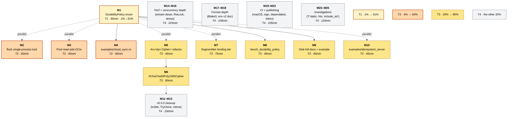

# Plan — v0.5.0 cloud-sync throughput batch

**Created:** 2026-07-20 03:40 CEST
**Author:** Crush (glm-5.2), prompted by Lars
**Status:** **SHIPPED 2026-07-20** — M1-M10 + M11-M13 + M15-M16 + M18-M22 all landed. Commits `4b9bda9` through `f2327b1` (12 commits). Shipped as v0.5.0 on crates.io + GitHub releases. M14 (streaming CBOR) and M17 (Blake3 checksum) deferred to envelope v2. Full self-review at `docs/status/2026-07-20_06-49_v0.5.0-batch-shipped-two-ci-bugs-caught.md`. ~~PLAN - pending execution approval.~~
**Scope:** The first release that makes the 2026-07-20 reframing (single-process throughput buffer for cloud sync) **true** rather than aspirational. Lands configurable durability, enforces the single-process invariant, ships XChaCha20, and proves the cloud-sync drain loop end-to-end.

---

## Context (read this first)

### Where we are

The 2026-07-20 reframing session repositioned the crate from "durable bounded queue" to "high-throughput local buffer for cloud sync, single-process by design, durability-configurable, at-least-once delivery, optional performant encryption." The README, AGENTS.md, and TODO_LIST.md were rewritten to match (commits `cfe79b5` → `e78a332` → `e08bf3b` → `b5d0473`). Working tree clean; `origin/master..HEAD` empty; CI unblocked.

The SegmentStore trait extraction + loom proof of `delete_acked`+`append` already shipped (`b5d0473`). The write-side zstd CCtx pooling shipped (2.07× append win). What remains is **the actual code that delivers on the reframed promises**.

### The vision (test for every item)

> Single-process, high-performance local buffer for cloud sync, with optional performant encryption for places where speed matters more than crash resilience.

Every task below must advance at least one of: **single-process**, **throughput**, **cloud-sync usability**, **performant encryption**, **honest crash semantics**. Items that don't — pure quality-of-life refactors with no vision tie-in — are deferred to v0.6+ or rejected.

### The four open decisions (locked 2026-07-20)

These were settled in the reframing chat and are NOT re-opened by this plan:

1. **Lock failure mode = fail-fast** — `Err(SegmentError::Locked)`, no block, no timeout.
2. **DurabilityPolicy default = `Segment` for one release, then flip to `Throughput`** with a deprecation note.
3. **Cursor file = REJECTED** — app-owned (verified against monitor365's SQLite-backed `SyncCursor`).
4. **XChaCha20 rollout = `recommended_cipher()` for new buffers**, AES-GCM selectable, legacy still reads.
5. **Disk-full behavior = metrics-not-policy** — segment-buffer exposes `store_pressure()`, upstream consumer configures response.

---

## Pareto breakdown

### The 1% that delivers 51% — `DurabilityPolicy::Throughput`

Without this, the "throughput buffer for cloud sync" claim is marketing. With it, the per-flush fsync disappears from the hot path (typically a 5–10× win on fast storage), the cloud becomes the durable layer by construction, and the README's crash-behavior table becomes true. Everything else in the reframing is positioning; this is the substance.

Single item: **M1 — `DurabilityPolicy` enum (Maximal / Segment / Throughput) + `Maximal` dir-sync fix.**

### The 4% that delivers 64% — complete the cloud-sync value chain

Add the items that make the cloud-sync story **safe** and **demonstrable**:

- **M2 — `flock` single-process lock.** Without it, the single-process invariant is a doc claim; two processes silently corrupt `head_seq`/`next_seq`.
- **M3 — Pool read-side zstd `DCtx`.** Cloud sync is read-heavy (draining the buffer). Symmetric to the write-side 2.07× win.
- **M4 — `examples/cloud_sync.rs`.** Without a runnable drain loop, users can't see how the at-least-once model fits together.

### The 20% that delivers 80% — v0.5.0 breaking batch that's vision-aligned

Add the rest of the coherent v0.5.0 release:

- **M5 — `Arc<dyn SegmentCipher>` refactor.** Prereq for M6 (config must be cloneable for `recommended_cipher()`).
- **M6 — `XChaCha20Poly1305Cipher`.** The "performant encryption" pillar.
- **M7 — `SegmentIter<'_, T>` lending iterator.** Drain-loop ergonomics.
- **M8 — `Throughput` vs `Segment` A/B benchmark.** Sizes the headline claim for the release notes.
- **M9 — Disk-full backpressure docs + `examples/cloud_sync_disk_full.rs`.** Closes the failure-mode story.
- **M10 — `examples/idempotent_server.rs`.** Teaches the consumer-side dedup the model requires.

### The other 20% (to reach 100%)

- Quality-of-life breaking changes: IoSite, TryClone, mtime probe (M11–M13).
- Perf depth: streaming deserialise (M14).
- Concurrency depth: RwLock investigation, latency stress (M15–M16).
- Format depth: Blake3 checksum, envelope v2 design (M17–M18).
- CI/tooling: macOS flake, commit signing, dependabot auto-merge (M19–M21).
- Publishing: `CARGO_REGISTRY_TOKEN` (M22).
- Investigations: `T: 'static`, Nix profile, `include_str!` (M23–M25).

**Explicitly deferred to v0.6+ or rejected** (not scheduled in this plan, kept in TODO_LIST.md for posterity):

- Streaming/incremental cipher (RFC 8450 chunked AEAD) — v0.6+, large format change.
- Compression-algorithm negotiation — wait for concrete demand.
- Envelope metadata block — wait for envelope v2.
- `SegmentStore` second impl (S3, in-memory) — wait for second consumer; trait already exists.
- Async I/O feature — large surface, no current consumer.
- Extract AES-GCM to its own crate — premature.
- `cargo supply-chain` — belt-and-braces, low value today.
- Skill-contract HTML debt — renegotiate separately.

---

## Comprehensive plan — 25 medium tasks (30–100 min each)

**Sort order:** Pareto tier first, then Impact × Customer Value ÷ Effort within tier. Dependencies noted in the last column — they are the load-bearing constraints, not the sort.

| ID      | Tier | Task                                                                                                                                                                                              | Effort | Impact    | Customer value                                                     | Depends on |
| ------- | ---- | ------------------------------------------------------------------------------------------------------------------------------------------------------------------------------------------------- | ------ | --------- | ------------------------------------------------------------------ | ---------- |
| **M1**  | T1   | `DurabilityPolicy` enum (`Maximal`/`Segment`/`Throughput`); thread into `segment::write`; `Maximal` adds `dir.sync_all()`; `Throughput` drops fsync; default `Segment`                            | 90 min | Very High | "Speed > crash resilience" becomes literally true                  | —          |
| **M2**  | T2   | `flock`-based exclusive lock on `.segment-buffer.lock` sidecar at `open()`; typed `SegmentError::Locked`; released on `Drop`; cross-platform via `fs4`                                            | 60 min | Very High | Single-process invariant enforceable                               | —          |
| **M3**  | T2   | Pool read-side `zstd::bulk::Decompressor` on `SegmentBuffer` (symmetric to write-side `Compressor`); thread through `segment::read`                                                               | 45 min | High      | Read-heavy drain workloads get faster                              | —          |
| **M4**  | T2   | `examples/cloud_sync.rs` — runnable at-least-once drain loop with fake `cloud_upload` (transient failure + recovery simulation)                                                                   | 60 min | High      | Vision demonstrable end-to-end                                     | M1         |
| **M5**  | T3   | `Arc<dyn SegmentCipher>` instead of `Box` — make `SegmentConfig: Clone`; update all call sites + builder                                                                                          | 45 min | High      | Prereq for M6; unblocks `recommended_cipher()`                     | —          |
| **M6**  | T3   | `XChaCha20Poly1305Cipher` under `encryption` feature; `[24-byte nonce][ciphertext+tag]`; legacy AES-GCM still reads; `SegmentConfigBuilder::recommended_cipher()` picks XChaCha20 for new buffers | 90 min | High      | Performant-encryption pillar; no 2³²-msg limit                     | M5         |
| **M7**  | T3   | `SegmentIter<'_, T>` GAT-based lending iterator; `iter_from(start)` method; keep `for_each_from` for backward compat                                                                              | 75 min | Medium    | Drain-loop ergonomics (`for (seq, item) in buf.iter_from(0)?`)     | —          |
| **M8**  | T3   | `bench_durability_policy` — A/B `Throughput` vs `Segment` vs `Maximal` on append + drain; write perf doc                                                                                          | 45 min | High      | Headline number for release notes                                  | M1         |
| **M9**  | T3   | Disk-full backpressure docs + `examples/cloud_sync_disk_full.rs` showing `store_pressure() > threshold → Err` pattern                                                                             | 45 min | Medium    | Failure-mode story complete; eviction-is-a-hard-no taught          | M1         |
| **M10** | T3   | `examples/idempotent_server.rs` — minimal in-process server stub with `(producer_id, seq)` dedup; demonstrates what the library can't enforce                                                     | 45 min | Medium    | At-least-once model fully taught                                   | —          |
| **M11** | T4   | `IoSite` enum for `SegmentError::Io` (`Dir` / `Segment(PathBuf)` / `Unknown`); replaces `Option<PathBuf>`                                                                                         | 45 min | Low       | Better error diagnostics                                           | —          |
| **M12** | T4   | `TryClone` for `SegmentConfigBuilder` (errors on cipher-bearing configs) OR loud doc                                                                                                              | 30 min | Low       | Builder ergonomics                                                 | M5         |
| **M13** | T4   | mtime probe for scan cache — capability probe at `open()` (sentinel file + re-stat); on mtime=0 fs, fall back to today's behavior verbatim                                                        | 75 min | Low       | External-tamper detection on capable fs; zero regression elsewhere | —          |
| **M14** | T4   | Streaming CBOR deserialise + early-stop at `limit`; `read_segment` stops after `limit` items                                                                                                      | 90 min | Medium    | `read_from(limit=N)` cost becomes `O(limit)` not `O(segment_size)` | —          |
| **M15** | T4   | `RwLock` vs `Mutex` investigation — measure read-heavy workload under both; document or implement                                                                                                 | 60 min | Low-Med   | Read scalability if data points to a win                           | —          |
| **M16** | T4   | 16 writers × 4 readers × 1M events stress test with p50/p99 latency histogram (not just throughput)                                                                                               | 75 min | Medium    | Latency distribution evidence, not just throughput                 | —          |
| **M17** | T4   | Per-segment Blake3 checksum in reserved envelope bytes (bit-rot detection distinct from cipher auth)                                                                                              | 60 min | Low       | Silent-corruption detection                                        | —          |
| **M18** | T4   | Envelope v2 design doc — migration path, reserved-bytes repurpose rules, version negotiation                                                                                                      | 45 min | Low       | Unblocks future format work                                        | —          |
| **M19** | T4   | macOS flake verification — `aarch64-darwin`, `x86_64-darwin` in `nix flake check`                                                                                                                 | 30 min | Low       | Reproducibility on Apple Silicon                                   | —          |
| **M20** | T4   | Commit signing fix — configure `gpg.ssh.allowedSignersFile`; verify regular commits sign                                                                                                          | 15 min | Low       | Audit trail integrity                                              | —          |
| **M21** | T4   | Dependabot auto-merge — `gh repo edit --enable-auto-merge` + per-updater config + branch-protection rule                                                                                          | 30 min | Low       | Prevents PR pile-up (8 during last CI-broken window)               | —          |
| **M22** | T4   | `CARGO_REGISTRY_TOKEN` in GH Actions secrets; wire `publish.yml` to publish on tag                                                                                                                | 30 min | Medium    | Automated releases (currently dormant)                             | —          |
| **M23** | T4   | `T: 'static` relaxation investigation — confirm whether mutex bound is the only reason                                                                                                            | 45 min | Low       | Possibly放宽es generic constraint                                  | —          |
| **M24** | T4   | Nix build profile — set `ZSTD_SYS_USE_PKG_CONFIG=1` to pre-build zstd as Nix dep (cut ~164s test check)                                                                                           | 45 min | Low       | Faster hermetic CI                                                 | —          |
| **M25** | T4   | `include_str!("../README.md")` investigation — separate snippet vs hand-written crate doc                                                                                                         | 30 min | Low       | Dodges `craneLib.cleanCargoSource` sandbox strip                   | —          |

**Totals:** ~1495 min (~25 h). T1+T2+T3 (the Pareto cream, M1–M10) = ~555 min (~9.25 h, 37% of the effort, ~80% of the value).

---

## Fine breakdown — sub-tasks max 12 min each

Only the Pareto cream (M1–M10) is broken down here at atomic granularity. T4 tasks (M11–M25) are left at medium granularity — they will be detailed when they get promoted to an active execution batch. (Rationale: the user's 80/20 directive concentrates effort where value lives; over-decomposing T4 investigation items is false precision.)

### M1 — `DurabilityPolicy` enum (T1, 90 min)

| Sub   | Description                                                                                                                                                                                          | Min |
| ----- | ---------------------------------------------------------------------------------------------------------------------------------------------------------------------------------------------------- | --- |
| M1.1  | Define `pub enum DurabilityPolicy { Maximal, Segment, Throughput }` in `src/lib.rs` with field-level doc explaining each mode's fsync behavior + worst-case crash window                             | 8   |
| M1.2  | Add `pub durability: DurabilityPolicy` to `SegmentConfig` (`#[non_exhaustive]`, so field-reassignment + `Default::default()` still work); `Default = Segment`                                        | 6   |
| M1.3  | Add `pub fn durability(mut self, policy: DurabilityPolicy) -> Self` to `SegmentConfigBuilder`                                                                                                        | 5   |
| M1.4  | Thread `policy: DurabilityPolicy` into `segment::write` signature; keep `compressor` and `cipher` args                                                                                               | 8   |
| M1.5  | Branch in `segment::write`: `Maximal` → `file.sync_all()?; fs::rename(...)?; let d = fs::File::open(dir)?; d.sync_all()?;`                                                                           | 10  |
| M1.6  | `Segment` branch → today's behavior verbatim (`file.sync_all` + `rename`, no dir sync)                                                                                                               | 4   |
| M1.7  | `Throughput` branch → no `sync_all`, just `rename` (file data flushes on kernel timer)                                                                                                               | 5   |
| M1.8  | Store `durability` on `SegmentBuffer` at `open_with_report`; pass through at every `write_segment` call site                                                                                         | 8   |
| M1.9  | Property test: each policy roundtrips `append` → `flush` → `read_from` (no crash-semantics claim yet, just functional correctness)                                                                   | 10  |
| M1.10 | Property test: `Throughput` mode actually skips fsync — wrap `RealStore` file ops in a counting mock if needed, or assert via `strace` integration test (decide: counting mock is better — portable) | 12  |
| M1.11 | Update `AGENTS.md` § "Durability model" — strike "proposed", mark "shipped in v0.5.0"                                                                                                                | 6   |
| M1.12 | Update `README.md` crash-behavior table — strike "Proposed for v0.5.0", mark "Shipped"                                                                                                               | 5   |

### M2 — `flock` single-process lock (T2, 60 min)

| Sub  | Description                                                                                                                                | Min |
| ---- | ------------------------------------------------------------------------------------------------------------------------------------------ | --- |
| M2.1 | Add `fs4` dep to `Cargo.toml` (cross-platform advisory file locking; replaces `fs2` which is unmaintained)                                 | 5   |
| M2.2 | Add `Locked` variant to `SegmentError` (typed: carries the lock file path)                                                                 | 6   |
| M2.3 | `Display`/`source`/`Debug` for `Locked`; covers `# Errors` doc pattern                                                                     | 6   |
| M2.4 | In `open_with_report`: open `.segment-buffer.lock` (create if missing), `try_lock_exclusive()`; on `Err` → `SegmentError::Locked`          | 12  |
| M2.5 | Hold the lock file handle in a `lock_file: Option<fs::File>` field on `SegmentBuffer` (the fd-holds-the-lock model)                        | 8   |
| M2.6 | `Drop for SegmentBuffer` — when kernel releases the fd, the lock releases; explicit no-op (document this) OR explicit `unlock` for clarity | 6   |
| M2.7 | Unit test: second `open()` on the same dir returns `Err(SegmentError::Locked)`; release (drop first) then `open()` succeeds                | 10  |
| M2.8 | Update `AGENTS.md` § "Single-process invariant" — strike "not yet enforced", document `fs4` + lock-file path                               | 5   |

### M3 — Pool read-side `Decompressor` (T2, 45 min)

| Sub  | Description                                                                                                                                        | Min |
| ---- | -------------------------------------------------------------------------------------------------------------------------------------------------- | --- |
| M3.1 | Add `decompressor: Mutex<zstd::bulk::Decompressor<'static>>` to `SegmentBuffer`; allocate once at `open_with_report`                               | 8   |
| M3.2 | Thread `decompressor: &mut Decompressor` into `segment::read`/`decode_payload`; call site `zstd::decode_all(...)` → `decompressor.decompress(...)` | 10  |
| M3.3 | Update direct callers of `segment::read` in tests + property_tests to construct a `Decompressor`                                                   | 8   |
| M3.4 | Bench `bench_read_from` re-run; capture cold-vs-warm delta vs pre-DCtx-pooling baseline; update `docs/perf/2026-07-20_read-from-scan-cache.md`     | 12  |
| M3.5 | Doc comment on the `decompressor` field explaining the symmetry with the write-side `Compressor` pooling                                           | 5   |

### M4 — `examples/cloud_sync.rs` (T2, 60 min)

| Sub  | Description                                                                                                                             | Min |
| ---- | --------------------------------------------------------------------------------------------------------------------------------------- | --- |
| M4.1 | Scaffold `examples/cloud_sync.rs`: open buffer with `DurabilityPolicy::Throughput`; append 10k items; flush                             | 8   |
| M4.2 | Define `CloudUploader` struct with `upload(&self, batch: &[T], start_seq: u64) -> Result<u64>` trait; impl `FakeUploader` that succeeds | 10  |
| M4.3 | Implement the drain loop: `read_from(cursor, 1000)` → `upload` → `delete_acked(cursor + count - 1)` → advance cursor                    | 12  |
| M4.4 | Add a `FlakyUploader` that fails the first 2 calls per batch then succeeds (simulates transient cloud outage)                           | 8   |
| M4.5 | Demonstrate retry-on-failure with no skip (the batch is retried until success — at-least-once in action)                                | 8   |
| M4.6 | Print final stats: items uploaded, retried, dedup-assumed; assert all 10k items drained                                                 | 6   |
| M4.7 | Cross-link from `README.md` cloud-sync section ("see `examples/cloud_sync.rs`")                                                         | 4   |

### M5 — `Arc<dyn SegmentCipher>` refactor (T3, 45 min)

| Sub  | Description                                                                                                                                                           | Min |
| ---- | --------------------------------------------------------------------------------------------------------------------------------------------------------------------- | --- |
| M5.1 | Change `SegmentConfig.cipher: Option<Box<dyn SegmentCipher>>` → `Option<Arc<dyn SegmentCipher + Send + Sync>>`                                                        | 8   |
| M5.2 | Derive `Clone` for `SegmentConfig` (now possible); audit `#[non_exhaustive]` interaction                                                                              | 6   |
| M5.3 | Update `SegmentConfigBuilder::cipher` to take `impl Into<Arc<dyn SegmentCipher + Send + Sync>>`                                                                       | 8   |
| M5.4 | Update `AesGcmCipher` construction sites in `examples/encrypted.rs`, tests, property_tests                                                                            | 8   |
| M5.5 | Decide: does `cipher()` builder method accept `Arc` directly or wrap a `Box`/raw value for ergonomics? (Pick: accept `Arc` raw; document the `Arc::new(cipher)` call) | 6   |
| M5.6 | Audit the pre-1.86 `ErrorExt` workaround — does `Arc` change anything? (It shouldn't; the cipher trait object is separate from the error type)                        | 5   |

### M6 — `XChaCha20Poly1305Cipher` (T3, 90 min)

| Sub   | Description                                                                                                                                                                                                                                                                                                                                                                   | Min |
| ----- | ----------------------------------------------------------------------------------------------------------------------------------------------------------------------------------------------------------------------------------------------------------------------------------------------------------------------------------------------------------------------------- | --- |
| M6.1  | Add `chacha20poly1305` dep under existing `encryption` feature (already pulled transitively? verify; if not, add)                                                                                                                                                                                                                                                             | 6   |
| M6.2  | Define `pub struct XChaCha20Poly1305Cipher { key: [u8; 32] }` in `src/cipher.rs` (or `src/xchacha.rs` if cipher.rs grows)                                                                                                                                                                                                                                                     | 8   |
| M6.3  | Impl `SegmentCipher for XChaCha20Poly1305Cipher` — `encrypt`: 24-byte random nonce via `rand::thread_rng()`, XChaCha20Poly1305 AEAD, output `[nonce][ciphertext+tag]`                                                                                                                                                                                                         | 12  |
| M6.4  | `decrypt`: split nonce/tag, AEAD open; map errors to `CipherError`                                                                                                                                                                                                                                                                                                            | 10  |
| M6.5  | On-disk format doc in `AGENTS.md` § "Encryption on-disk format" — add the XChaCha20 row                                                                                                                                                                                                                                                                                       | 6   |
| M6.6  | Property test: XChaCha20 roundtrip (encrypt → decrypt = identity)                                                                                                                                                                                                                                                                                                             | 8   |
| M6.7  | Property test: XChaCha20 tamper-detection (flip a byte → decrypt errors)                                                                                                                                                                                                                                                                                                      | 8   |
| M6.8  | Property test: short-payload rejection (< 24-byte nonce → `SegmentError::Integrity`)                                                                                                                                                                                                                                                                                          | 6   |
| M6.9  | Decide legacy-segment detection: does `segment::read` need a magic to distinguish AES-GCM from XChaCha20 payloads? (Likely: cipher choice must be config-supplied, not auto-detected — both formats have the same `[nonce][ct+tag]` shape, just different nonce lengths. Document the implication: a directory is one-cipher-only; mixed-cipher directories need envelope v2) | 12  |
| M6.10 | `SegmentConfigBuilder::recommended_cipher()` — returns `Arc<dyn SegmentCipher>` for XChaCha20 if `encryption` feature is on; AES-GCM fallback if not; documents the choice                                                                                                                                                                                                    | 10  |
| M6.11 | `examples/encrypted.rs` — add a parallel `xchacha` section showing the new cipher                                                                                                                                                                                                                                                                                             | 6   |

### M7 — `SegmentIter<'_, T>` lending iterator (T3, 75 min)

| Sub  | Description                                                                                                                                                                                   | Min |
| ---- | --------------------------------------------------------------------------------------------------------------------------------------------------------------------------------------------- | --- |
| M7.1 | Decide: GAT-based lending iterator vs `impl Iterator<Item = (u64, T)>` (which requires owning `T`, not a borrow). For `T: Clone`, owned is simpler and sufficient.                            | 8   |
| M7.2 | Pick **owned-item iterator** (`T: Clone` is already required by the crate). Define `pub struct SegmentIter<'a, T> { buf: &'a SegmentBuffer<T>, cursor: u64, pending: std::vec::IntoIter<T> }` | 10  |
| M7.3 | Impl `Iterator for SegmentIter<'_, T>` — yields `(seq, T)`; refills `pending` from `read_from` when drained                                                                                   | 12  |
| M7.4 | `pub fn iter_from(&self, start_seq: u64) -> Result<SegmentIter<'_, T>>` constructor                                                                                                           | 6   |
| M7.5 | Keep `for_each_from` unchanged (backward compat)                                                                                                                                              | 2   |
| M7.6 | Unit test: `iter_from(0)` on a buffer with 5 items yields seqs 0..5 in order                                                                                                                  | 8   |
| M7.7 | Property test: iter_from + delete_acked interleave correctly                                                                                                                                  | 10  |
| M7.8 | Doc example in `lib.rs` showing `for (seq, item) in buf.iter_from(0)? { ... }`                                                                                                                | 6   |

### M8 — `bench_durability_policy` (T3, 45 min)

| Sub  | Description                                                                                                               | Min |
| ---- | ------------------------------------------------------------------------------------------------------------------------- | --- |
| M8.1 | New bench target `benches/bench_durability.rs` — criterion group per policy                                               | 10  |
| M8.2 | Three benchmarks: `append_batch_100_maximal`, `_segment`, `_throughput`; same payload across all three                    | 12  |
| M8.3 | Add `read_from_drain` variant per policy (read side is mostly policy-invariant; sanity check)                             | 10  |
| M8.4 | Run A/B, capture numbers; write `docs/perf/2026-07-21_durability-policy.md` (or current date) with table + interpretation | 12  |

### M9 — Disk-full backpressure docs + example (T3, 45 min)

| Sub  | Description                                                                                                                                                       | Min |
| ---- | ----------------------------------------------------------------------------------------------------------------------------------------------------------------- | --- |
| M9.1 | `examples/cloud_sync_disk_full.rs` — open with tiny `max_size_bytes` (1 MiB); append loop checks `store_pressure() > 0.9` and returns `Err` to simulated producer | 12  |
| M9.2 | Show the producer-side response: slow down, sample, drop — driven by upstream, not the library                                                                    | 8   |
| M9.3 | Loud comment: eviction is a hard no for at-least-once; the library never silently drops unacked segments                                                          | 6   |
| M9.4 | New `docs/CLOUD_SYNC.md` (or extend `README.md`): "Failure modes" section — disk full, cloud down, crash mid-drain, cursor lost                                   | 12  |
| M9.5 | Cross-link from `AGENTS.md` § "At-least-once delivery model" and `README.md` § "Backpressure"                                                                     | 5   |

### M10 — `examples/idempotent_server.rs` (T3, 45 min)

| Sub   | Description                                                                                                                                                   | Min |
| ----- | ------------------------------------------------------------------------------------------------------------------------------------------------------------- | --- |
| M10.1 | Define `IdempotentServer { seen: HashSet<(ProducerId, u64)> }` in `examples/idempotent_server.rs`                                                             | 8   |
| M10.2 | `pub fn ingest(&mut self, producer: ProducerId, seq: u64, item: T) -> bool` — returns true if new, false if duplicate                                         | 8   |
| M10.3 | Driver: open buffer, append 1k items, drain via `read_from` → `ingest` → `delete_acked`; then re-drain the same range and show `ingest` returns false for all | 12  |
| M10.4 | Doc comment at top: this is the pattern the library's at-least-once model requires from the consumer                                                          | 6   |
| M10.5 | Cross-link from `README.md` cloud-sync section and `AGENTS.md` § "Layer split vs monitor365"                                                                  | 5   |

**Sub-task totals (M1–M10 only):** ~93 sub-tasks, ~10.5 h. Within the user's "max 12 min each" cap. T4 tasks (M11–M25) deliberately left at medium granularity — they get atomic breakdown when promoted to an active execution batch.

---

## Mermaid execution graph

**Critical path:** M5 → M6 (cipher pillar); M1 → {M4, M8, M9} (policies enable their consumers). M1 and M5 are both unblocked and should land first, in parallel.

**Bottleneck:** M1 — it's on the critical path of three follow-ups. Land M1 first; meanwhile M2, M3, M5, M7, M10 can all proceed in parallel.

---

## Risks (things that could verschlimmbessern this system)

1. **`fs4` lock semantics on NFS / SMB.** Advisory locks behave badly on network filesystems. If a user puts the buffer on NFS (unusual but possible), `flock` may falsely report available or falsely report held. Mitigation: document "local filesystem only" in the lock error message and the README.

2. **`Throughput` mode crash semantics surprise.** Users upgrading from v0.4.x with default `Segment` to v0.5.0 with default `Segment` are unaffected — but if/when the default flips to `Throughput`, silent crash-window widening is the kind of thing that ends in a postmortem. Mitigation: deprecation cycle (one release of `Segment` default + deprecation note, then flip), per decision Q2.

3. **Mixed-cipher directories.** XChaCha20 and AES-GCM have the same `[nonce][ct+tag]` shape but different nonce lengths. Without envelope v2, a directory is one-cipher-only; changing ciphers requires draining + re-creating the directory. M6.9 surfaces this; it must be loudly documented or it will corrupt reads.

4. **`Maximal` dir-sync cost.** Closing the rename-window gap with `dir.sync_all()` per flush is the right default for standalone-queue deployments, but on a slow disk it's another fsync per flush — could surprise users moving from `Segment` to `Maximal`. Mitigation: M8 benchmark must measure this explicitly, not just `Throughput`'s win.

5. **`iter_from` holding no lock between yields.** `SegmentIter` reads a snapshot of `pending`, yields items, then calls `read_from` again when drained. Concurrent `delete_acked` between yields could remove a segment the iterator hasn't reached yet — `read_from` already handles this (returns what's available), but the iterator semantics ("monotonic, gap-free") need a property test to prove it under interleaving (M7.7).

6. **mtime probe (M13) is T4 and not in this batch.** The current scan-cache invalidation is in-process only; external tampering is undetected until `sync_disk_bytes` is called. This is an accepted limitation, not a regression — but it should stay documented.

---

## Definition of done (per task)

Before marking any task complete:

- [ ] `cargo fmt --all -- --check` clean
- [ ] `cargo clippy --all-targets -- -D warnings` AND `cargo clippy --all-targets --features encryption -- -D warnings` clean
- [ ] `cargo test --no-fail-fast --features encryption` passes (existing + new tests)
- [ ] `cargo doc --no-deps --features encryption` builds (no broken intra-doc links)
- [ ] `RUSTFLAGS="--cfg loom" cargo test --features loom --test loom --release` passes (if the change touches any code under the buffer's mutex)
- [ ] `nix fmt -- --fail-on-change` clean
- [ ] Affected doc in `README.md` / `AGENTS.md` / `CHANGELOG.md` `[Unreleased]` updated in the same commit
- [ ] No working-tree drift — `git status` clean or every modified file explained

**Release gate for v0.5.0 (per AGENTS.md Rule 9):** before tagging, `gh run list --limit 4` must show every run on `master` as `success`. Local-only green is NOT release-green.

---

## Execution order recommendation

1. **Phase 1 — Pareto cream, parallelizable** (~3 h wall-clock with 2 threads):
   - M1 (DurabilityPolicy) — sole owner of critical path, land first
   - M2 (flock) — fully parallel
   - M3 (DCtx pooling) — fully parallel
   - M5 (Arc<dyn Cipher>) — fully parallel, but blocks M6

2. **Phase 2 — cipher pillar** (~2 h):
   - M6 (XChaCha20) — once M5 lands
   - M7 (SegmentIter) — fully parallel with M6

3. **Phase 3 — demonstrate the value** (~3 h):
   - M4 (cloud_sync example) — once M1 lands
   - M8 (Throughput bench) — once M1 lands
   - M9 (disk-full docs) — once M1 lands
   - M10 (idempotent server) — fully parallel

4. **Phase 4 — T4 cleanup** (~12 h, batch into v0.5.1 or v0.6.0):
   - M11–M25 promoted to active batch when v0.5.0 ships

**Cut line for v0.5.0:** M1–M10. If scope must shrink, cut M7 (ergonomics), then M10 (teaching example), then M9 (failure-mode docs). Never cut M1, M2, M3, M5, M6 — those are the vision.
