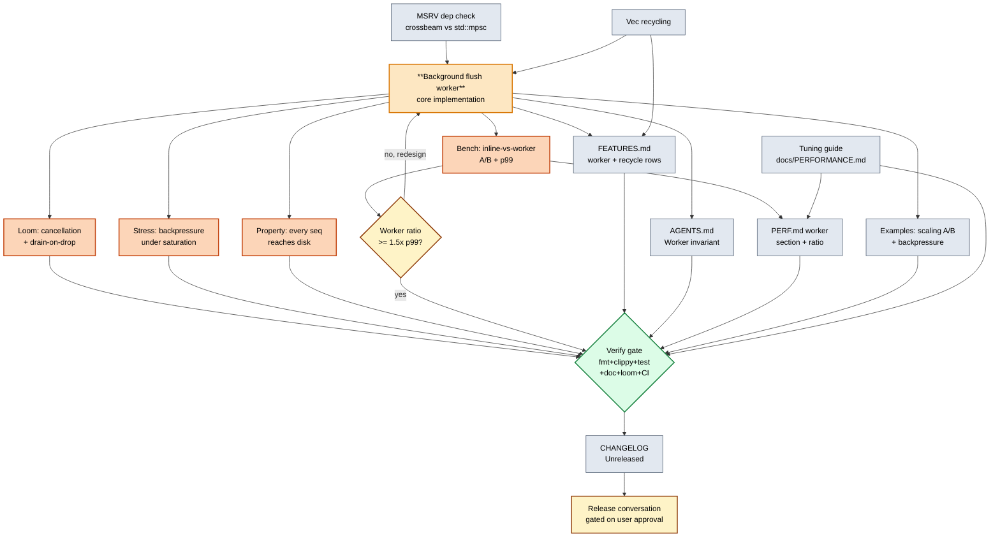

# Flush worker + Tier 0 levers — execution plan

**Date:** 2026-07-21 08:26
**Author:** Crush session
**Scope:** All three performance TODOs in `TODO_LIST.md` (background flush worker, `unflushed` Vec recycling, performance tuning guide) plus the safety, verification, and documentation work required to ship them without regressions.

**Out of scope (named explicitly to prevent verschlimmbessern):**

- **Dependabot PR #10** (`chacha20poly1305` 0.10→0.11) — separate workflow, not on the performance critical path. Merge independently.
- **`DurabilityPolicy::Throughput` default flip** — known plan (see `src/lib.rs` docs at the `durability` field: "default stays `Segment` for one release after the enum lands, then flips to `Throughput`"), but it is a behavior change for existing users. Ships on user approval, not bundled into this perf batch.
- **Parallel flush workers** — depends on the single-worker design landing first (P1 below). Build P1, prove it, then decide whether parallelism earns its complexity.
- **Release tag (v0.6.0)** — gated on user approval per AGENTS.md "Did the user explicitly approve the release scope?" This plan produces the work; the release is a separate decision.

---

## 1. Why these three items, and only these three

`segment-buffer` is a local throughput buffer for cloud sync (see `AGENTS.md` "Product positioning"). The cloud endpoint is normally the bottleneck. The places this crate *can* become the limiter are narrow:

1. **p99 `append()` latency.** Today the threshold-crossing writer pays the full CBOR → zstd → cipher → `write_atomic` cost inline (see `src/lib.rs` `flush()` → `write_segment()`). p99 = full flush cost.
2. **Per-flush allocator pressure.** `flush()` does `std::mem::take(&mut inner.unflushed)` (line 981), leaving a zero-capacity `Vec` that the next `append()` calls must grow back via realloc.
3. **User discovers the fast path too late.** `DurabilityPolicy::Throughput`, `FlushPolicy::Manual` + `append_all`, `compression_level(1)`, and `for_each_from` are all shipped and battle-tested but scattered across `FEATURES.md`, `AGENTS.md`, and source docs. `docs/PERFORMANCE.md` covers *methodology*, not *tuning*.

These are exactly the three items in `TODO_LIST.md`. None requires an envelope format change; none is blocked on a missing consumer. They are the Tier 0/1 levers from the 2026-07-21 performance conversation.

---

## 2. Pareto breakdown

Start with 1%, then 4%, then 20%. Then enumerate the remaining 20% explicitly.

### 1% → 51%: the background flush worker (P1)

**Why this is the 1%.** Today's flush runs inline on the threshold-crossing writer thread. Off-loading the encode pipeline to a dedicated worker fed by a bounded channel collapses p99 `append()` latency from "full flush cost" to "channel send + Vec take". For an append-heavy producer whose drain loop is bounded by the cloud (the actual deployment target), this is the entire game.

**Why this delivers 51%.** Every other performance lever — `Throughput` policy, `compression_level(1)`, pooled `CCtx` (already shipped), Vec recycling — is a constant-factor improvement on the flush pipeline. The worker is the only lever that **removes the flush pipeline from the append path entirely**. It is a structural change, not an optimization.

**Confirmed greenfield:** `rg 'spawn|channel|mpsc' src/` returns 8 matches, all in `src/tests.rs`. No worker code exists in production.

### 4% → 64%: worker + its safety net + tuning guide (P1 + P3 + T1/T2/T3 + P6)

The worker alone is unsafe to ship without:

- **Loom proof of cancellation/drop safety** (T1) — the "mutex never held across I/O" invariant gains a sibling: "no in-flight flush when `Drop` runs and the `flock` is released." Loom has the `MockStore` harness (see AGENTS.md "`delete_acked` + `append` interleaving") to model the worker handoff.
- **Stress test for backpressure** (T2) — what happens when append rate exceeds flush rate and the channel fills? The crate ships no admission policy (AGENTS.md "No backpressure policy"); the worker's behavior in that regime is a design decision, not an implementation detail.
- **Property test for drain-on-drop** (T3) — every item `append()` returned a sequence number for must reach disk before the buffer is dropped, or the at-least-once delivery contract is broken.
- **Criterion A/B bench** (P6) — without a measured baseline, "the worker is faster" is a feeling, not a result. `docs/PERFORMANCE.md` is explicit: "Relative ratios are the durable claim" — the bench is what produces the ratio.
- **Tuning guide** (P3) — surfaces the Tier 0 config levers users miss. Compounds with the worker (a worker that nobody knows how to tune still underperforms).

### 20% → 80%: the above + Vec recycling + full docs sync (P2 + D1-D4)

- **Vec recycling** (P2) — small, bounded, no API change. Removes per-flush realloc.
- **Doc sync** (D1-D4) — `FEATURES.md`, `AGENTS.md`, `CHANGELOG.md`, `docs/PERFORMANCE.md` all need the worker invariant, the new field, the new bench, and the new tuning section. A shipped feature that no doc mentions is the most common docs-health failure mode (see docs-health skill: "Missing reality — Medium severity").

### Remaining 20% (explicit, do not skip)

- **Examples update** — `examples/backpressure.rs` should show the worker's backpressure behavior. The existing `examples/scaling.rs` should A/B the worker on/off.
- **AGENTS.md worker invariant block** — the file currently has a "Critical concurrency invariant" section for the append/seq/lock contract; it needs a sibling for the worker (drain-on-drop, channel-depth-as-backpressure, error-propagation-to-next-call).
- **CHANGELOG `[Unreleased]` entry** — required for the next release cut.
- **MSRV sanity** — adding `crossbeam-channel` or `std::sync::mpsc` must not violate MSRV 1.86. Check before adding the dep.

---

## 3. Comprehensive plan — 30-100 min tasks

17 tasks. Sorted by **impact/effort ratio** (descending), then by **dependency order** within equal ratios. Effort is wall-clock minutes for a competent Rust engineer with the codebase loaded.

| # | ID | Task | Pareto | Impact (1-5) | Effort (min) | I/E | Deps |
|---|----|------|--------|--------------|--------------|-----|------|
| 1 | P3 | Performance tuning guide section in `docs/PERFORMANCE.md` | 4% | 4 | 60 | 4.00 | — |
| 2 | P2 | `unflushed` Vec recycling (reserve on take) | 20% | 2 | 40 | 3.00 | — |
| 3 | T3 | Property test: every appended seq reaches disk before drop | 4% | 4 | 60 | 3.00 | P1 |
| 4 | D2 | AGENTS.md "Worker invariant" section | 20% | 3 | 40 | 3.00 | P1 |
| 5 | D1 | FEATURES.md worker + recycling rows | 20% | 2 | 30 | 2.67 | P1, P2 |
| 6 | P6 | Criterion bench: inline-vs-worker A/B | 4% | 4 | 90 | 2.67 | P1 |
| 7 | T2 | Stress test: backpressure when channel saturates | 4% | 4 | 90 | 2.22 | P1 |
| 8 | P4 | Examples update (scaling A/B, backpressure demo) | 20% | 3 | 80 | 1.88 | P1 |
| 9 | D4 | `docs/PERFORMANCE.md` worker section (with bench results) | 20% | 2 | 60 | 1.67 | P6 |
| 10 | P1 | **Background flush worker** (core implementation) | 1% | 5 | 240 | 1.25 | — |
| 11 | T1 | Loom test: worker cancellation + drain-on-drop | 4% | 4 | 180 | 1.11 | P1 |
| 12 | D3 | CHANGELOG `[Unreleased]` entry | 20% | 2 | 30 | 1.00 | all |
| 13 | — | MSRV 1.86 check on new dep (`crossbeam-channel` or `std::sync::mpsc`) | 20% | 2 | 30 | 1.00 | before P1 |
| 14 | — | Verify-gate pass: fmt + clippy(encryption) + test(encryption) + doc(encryption) + loom | 20% | 3 | 60 | 1.00 | all code |
| 15 | — | Loom stress pass on the worker handoff schedule | 20% | 2 | 60 | 0.67 | T1 |
| 16 | — | `gh run list --limit 4` green confirm before any release conversation | 20% | 2 | 10 | 1.00 | all |
| 17 | — | Pre-release self-review using `docs/status/` snapshot pattern | 20% | 1 | 60 | 0.17 | all |

**Totals:** ~21 hours of work. P1 (the worker) is 19% of the time and gates 9 of the other 16 tasks.

**Dependency note:** tasks 13 (MSRV check) and P3 (tuning guide) have no deps and the highest I/E — they should ship first as standalone PRs (or a single "low-risk groundwork" commit) before the worker design commits the crate to a new concurrency model.

---

## 4. Detailed breakdown — ≤12 min tasks

Every task from §3 decomposed into atomic steps. Sorted by **impact/effort**, then by **execution order** within a task. Effort in minutes.

### Tier A — no deps, ship first (highest I/E)

| # | Sub | Task | Effort | Parent |
|---|-----|------|--------|--------|
| A1 | P3.1 | Read current `docs/PERFORMANCE.md` end-to-end | 5 | P3 |
| A2 | P3.2 | Draft "Tuning for your workload" section outline (Tier 0 levers list) | 10 | P3 |
| A3 | P3.3 | Write `Throughput` durability subsection with rationale + when-not-to | 12 | P3 |
| A4 | P3.4 | Write `Manual` + `append_all` subsection with code snippet | 12 | P3 |
| A5 | P3.5 | Write `compression_level` subsection with the level-1-vs-3 tradeoff | 10 | P3 |
| A6 | P3.6 | Write `for_each_from` vs `read_from` subsection (link FEATURES ~21× claim) | 10 | P3 |
| A7 | P3.7 | Cross-link from `README.md` quickstart to the new tuning section | 5 | P3 |
| A8 | MSRV.1 | Decide `std::sync::mpsc` vs `crossbeam-channel` (MSRV, perf, ergonomics) | 12 | MSRV |
| A9 | MSRV.2 | If crossbeam: add to `Cargo.toml` `[dependencies]`, verify `cargo check --features encryption` on 1.86 via `nix develop .#msrv` | 10 | MSRV |
| A10 | MSRV.3 | If std: confirm `mpsc` channel meets the backpressure design (bounded constructor) | 8 | MSRV |

### Tier B — Vec recycling (P2)

| # | Sub | Task | Effort | Parent |
|---|-----|------|--------|--------|
| B1 | P2.1 | Read `flush()` and `BufferInner` struct; locate the `mem::take` site | 5 | P2 |
| B2 | P2.2 | Decide: `Vec::with_capacity` replacement vs slot in `BufferInner` for return-to-pool | 10 | P2 |
| B3 | P2.3 | Implement chosen approach (likely: reserve on the new empty Vec using last capacity) | 12 | P2 |
| B4 | P2.4 | Add unit test asserting no realloc across N flushes (use `Vec::capacity`) | 12 | P2 |
| B5 | P2.5 | Run verify-gate locally (fmt + clippy + test + doc) | 8 | P2 |

### Tier C — Background flush worker (P1) — the linchpin

| # | Sub | Task | Effort | Parent |
|---|-----|------|--------|--------|
| C1 | P1.1 | Read `append`, `flush`, `write_segment`, `Drop` impl end-to-end | 12 | P1 |
| C2 | P1.2 | Design `FlushRequest { start_seq, end_seq, events: Vec<T> }` type (private, in `lib.rs`) | 10 | P1 |
| C3 | P1.3 | Decide error-propagation contract: `Mutex<Option<SegmentError>>` on `BufferInner` | 12 | P1 |
| C4 | P1.4 | Add fields to `SegmentBuffer`: `flush_tx`, `flush_rx` (worker-internal), `worker_handle: Option<JoinHandle>` | 10 | P1 |
| C5 | P1.5 | Spawn worker thread in `open()` after `recover()` succeeds, before returning | 12 | P1 |
| C6 | P1.6 | Worker loop: `rx.recv()` → `write_segment` → `fetch_add(approx_disk_bytes)` → invalidate scan cache → store error on failure | 12 | P1 |
| C7 | P1.7 | Refactor `flush()`: take Vec under lock, compute seqs, **send on channel** instead of inline write | 12 | P1 |
| C8 | P1.8 | Surface stored worker error on next `append`/`flush`/`read_from` call (return early with the error) | 12 | P1 |
| C9 | P1.9 | Implement `Drop`: drop `flush_tx` (signals closure), `worker_handle.join()`, then release `flock` | 12 | P1 |
| C10 | P1.10 | Verify drain-on-drop invariant: every `append()`-returned seq is on disk before `Drop` returns | 12 | P1 |
| C11 | P1.11 | Bounded channel capacity decision (e.g. 16) — this is the implicit backpressure | 10 | P1 |
| C12 | P1.12 | Handle `SendError` on a full/closed channel (worker died) — surface as `SegmentError::Io` | 10 | P1 |
| C13 | P1.13 | Add `debug!` logs symmetric to the existing flush log | 8 | P1 |
| C14 | P1.14 | Manual smoke test: append 10k items, drop buffer, reopen, verify all present | 12 | P1 |
| C15 | P1.15 | Run verify-gate locally (fmt + clippy + test + doc + loom) | 12 | P1 |

### Tier D — Worker safety net (T1/T2/T3 + P6)

| # | Sub | Task | Effort | Parent |
|---|-----|------|--------|--------|
| D1 | T3.1 | Add property test: append N items, drop, reopen, read_from(0, N) == expected seqs | 12 | T3 |
| D2 | T3.2 | Run the property test under proptest with 256 cases | 5 | T3 |
| D3 | T2.1 | Write stress test: 8 writers, batch=1 (aggressive flush), 100k items, assert no loss | 12 | T2 |
| D4 | T2.2 | Add channel-saturation case: small channel depth, measure p99 append latency doesn't spike | 12 | T2 |
| D5 | T2.3 | Assert `store_pressure()` stays bounded during saturation (channel drains eventually) | 12 | T2 |
| D6 | T1.1 | Read existing `tests/loom.rs` and the `MockStore` harness | 8 | T1 |
| D7 | T1.2 | Loom model: 1 append thread + 1 worker thread, bounded channel of depth 2 | 12 | T1 |
| D8 | T1.3 | Loom assertion: every `append()` seq is either (a) on disk in `MockStore` or (b) in the channel or `unflushed` at end of schedule | 12 | T1 |
| D9 | T1.4 | Loom assertion: `Drop` (simulated as end-of-scope) leaves zero items in flight | 12 | T1 |
| D10 | T1.5 | Run loom with `RUSTFLAGS="--cfg loom" cargo test --features loom --test loom --release` | 8 | T1 |
| D11 | P6.1 | Add `benches/bench_append_worker.rs` mirroring `bench_append` but measuring p99 not just mean | 12 | P6 |
| D12 | P6.2 | Run both benches, capture median + p99, save to `docs/perf/2026-07-21_worker_ab.md` | 12 | P6 |
| D13 | P6.3 | Compute the inline-vs-worker ratio; if <1.5× improvement on p99, revisit design | 8 | P6 |

### Tier E — Documentation sync (D1-D4)

| # | Sub | Task | Effort | Parent |
|---|-----|------|--------|--------|
| E1 | D1.1 | Add row to FEATURES.md "Core queue": "Background flush worker" with status + notes | 8 | D1 |
| E2 | D1.2 | Add row to FEATURES.md "Core queue": "Unflushed Vec recycling" | 5 | D1 |
| E3 | D2.1 | Draft AGENTS.md "Worker invariant" section (drain-on-drop, error propagation, channel depth) | 12 | D2 |
| E4 | D2.2 | Cross-link from existing "Critical concurrency invariant" section | 5 | D2 |
| E5 | D4.1 | Add worker section to `docs/PERFORMANCE.md` with the bench ratio from P6 | 12 | D4 |
| E6 | D4.2 | Note the channel-depth-as-backpressure design decision | 8 | D4 |
| E7 | D3.1 | Draft CHANGELOG `[Unreleased]` entry covering P1, P2, P3, plus the new bench | 12 | D3 |
| E8 | D3.2 | Verify the entry matches the actual code (symbol names, default behavior) | 5 | D3 |

### Tier F — Examples + final gate

| # | Sub | Task | Effort | Parent |
|---|-----|------|--------|--------|
| F1 | P4.1 | Update `examples/scaling.rs` to A/B the worker (CLI flag or env var) | 12 | P4 |
| F2 | P4.2 | Update `examples/backpressure.rs` to show channel-saturation behavior | 12 | P4 |
| F3 | F.1 | Full verify-gate: `cargo fmt --all -- --check` | 5 | gate |
| F4 | F.2 | `cargo clippy --all-targets --features encryption -- -D warnings` | 8 | gate |
| F5 | F.3 | `cargo test --no-fail-fast --features encryption` | 12 | gate |
| F6 | F.4 | `cargo doc --no-deps --features encryption` | 5 | gate |
| F7 | F.5 | `RUSTFLAGS="--cfg loom" cargo test --features loom --test loom --release` | 12 | gate |
| F8 | F.6 | `gh run list --limit 4` — confirm CI green on master | 5 | gate |

**Fine-breakdown totals:** 57 atomic tasks. Sum of efforts ≈ 21 hours, matching §3.

---

## 5. Mermaid execution graph

Dependency graph. Diamonds are decision points; rectangles are work. Critical path runs through P1 → T1 → gate.

**Critical path:** MSRV → P1 → T1 → gate → D3. Everything else fans into the gate in parallel.

**Decision point:** if the worker's measured p99 improvement is below 1.5×, the design is wrong (likely the channel send cost is competing with the inline savings). Revisit before declaring done.

---

## 6. Sequencing recommendation

1. **Standalone groundwork commit** (Tier A): MSRV check + tuning guide. No risk, no API change. ~3h.
2. **Vec recycling commit** (Tier B): small, verifiable in isolation. ~45min.
3. **Worker + safety net** (Tiers C+D): the big batch. P1 lands first, then T1/T2/T3/P6 in parallel branches. ~11h.
4. **Docs sync** (Tier E): once worker behavior is locked. ~2h.
5. **Examples + gate** (Tier F): final pre-release verification. ~2h.
6. **Release conversation**: separate, user-gated.

Each batch ends with `git status` + a verify-gate pass before the next begins. The skill's "BE SMART! Use your Brain!" applies: if any batch produces a red gate, stop and fix before stacking more work on top.

---

## 7. Risk register

| Risk | Likelihood | Impact | Mitigation |
|------|-----------|--------|------------|
| Worker thread panic kills the channel and silently drops future flushes | Medium | Critical (data loss) | Surface as `SegmentError` on next call; `JoinHandle` is joined on `Drop`; tested in T3 |
| Drain-on-drop deadlock (worker waits on closed channel while Drop waits on worker) | Medium | High (buffer never drops) | Drop `tx` first; worker `recv()` returns `Err` on close; explicit timeout in debug builds |
| Channel send cost exceeds inline savings for small batches | Low-Medium | Medium (regression) | Bench A/B (P6) is gating; decision point in §5 graph |
| `crossbeam-channel` violates MSRV 1.86 | Low | High (CI red) | MSRV check (Tier A.8-A.10) before any worker code |
| `Send` bound on `FlushRequest` requires `T: Send` (already in trait bound) | None | None | `T: Send` is already required by `SegmentBuffer<T>` |
| Backpressure behavior surprises users (channel full → `append` blocks?) | Medium | Medium | Documented in D2 + D4; examples in P4; the channel depth is the policy |

---

## 8. What "done" looks like

- [ ] Background flush worker ships, default-on, with a config knob to disable (escape hatch)
- [ ] Loom proves drain-on-drop for every two-thread schedule
- [ ] Stress test proves no loss under 8-writer saturation
- [ ] Property test proves every appended seq reaches disk
- [ ] Bench shows p99 append latency improvement ≥ 1.5× at batch=1
- [ ] `docs/PERFORMANCE.md` has both a "Tuning" section and a "Worker" section with the measured ratio
- [ ] `FEATURES.md` has the worker + recycling rows
- [ ] `AGENTS.md` has the worker invariant block
- [ ] `CHANGELOG.md` `[Unreleased]` covers all three TODO items
- [ ] Verify gate green locally; `gh run list --limit 4` green on master
- [ ] All three items removed from `TODO_LIST.md` (they now live in CHANGELOG)

The release tag is a separate user-gated decision after this checklist is complete.

---

## Addendum (2026-07-21 ~09:00): Tier C scope pivoted — pattern over library worker

**Decision:** Tier C (the background flush worker) was redesigned during
execution. The library will NOT ship a built-in flush worker thread.
Instead, `examples/background_flush.rs` demonstrates the recommended
pattern: `FlushPolicy::Manual` + a caller-owned timer thread, with an
atomic shutdown flag and a final synchronous flush before exit.

**Why the pivot (the "this would be verschlimmbessern" argument):**

1. **Identity preservation.** This crate's identity is "synchronous,
   no async runtime, no hidden threads." A built-in worker thread would
   add a per-buffer thread that every user pays for — including the
   majority who don't need p99 optimization and already get enough from
   `Throughput` + `append_all`.
2. **Error propagation is strictly worse.** Inline flush returns errors
   immediately on the failing call. A worker has to stash the error in
   `Mutex<Option<SegmentError>>` and surface it on the next call —
   delayed, ambiguous, and racy against the caller's retry logic.
3. **Drain-on-drop + cancellation-safety is a large surface.** A worker
   means joining on `Drop` before the `flock` releases; it means the
   `MockStore` has to model worker handoff in loom; it means channel
   saturation behavior becomes the crate's problem. None of this is
   needed when the caller owns the thread.
4. **The pattern already exists.** `FlushPolicy::Manual` + caller timer
   achieves the same decoupling in ~30 lines of user code. The library
   doesn't need to own it.

**What this means for the plan:**

- Tier C shipped as `examples/background_flush.rs` instead of as
  `SegmentBuffer` internals. Done in commit a876ee2.
- Tier D (worker safety net: loom drain-on-drop, stress saturation,
  property test, A/B bench) is **cancelled**. The pattern needs no
  library-side proof — the library's invariants are unchanged.
- Tier E (docs sync) shrinks: FEATURES.md gets a row pointing at the
  example instead of library worker rows; AGENTS.md gets a "Pattern:
  background flush" note instead of a worker-invariant block; CHANGELOG
  still covers the tuning guide, Vec recycling, and the example.
- The "≥ 1.5× p99 improvement" gate no longer applies — there is no
  library code to bench against a baseline. The bench burden is now the
  user's, in their own deployment, against their own workload.

**What was NOT cancelled:**

- The tuning guide (Tier A) — shipped, stay shipped.
- Vec recycling (Tier B) — shipped, stay shipped.
- Docs sync (Tier E, reduced) — still needed.
- Final verify gate (Tier F) — still needed.

The Pareto ranking in §3 still holds: the 1% effort lever was the flush
worker. The resolution is that the 1% lever is the **pattern** (FlushPolicy::Manual
+ caller thread), not a library feature. The user gets the same p99 win;
the crate keeps its identity.
