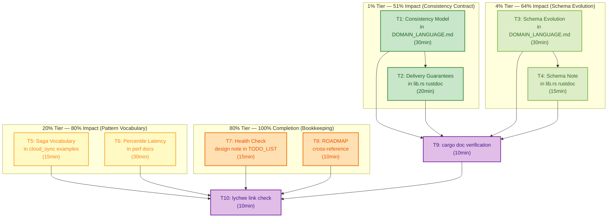

# Book Insights Action Plan: Closing the Documentation and Design Gaps

> **Captured:** 2026-07-23 15:50
> **Source:** [`docs/book-insights-mapping.md`](../book-insights-mapping.md)
> **Status:** Planning — not yet executed
> **Scope:** Five actionable gaps identified by mapping seven distributed-systems books against the segment-buffer codebase. The sixth gap (streaming AEAD) is already tracked on `ROADMAP.md` and correctly deferred.

---

## Context

The book insights mapping exercise produced three categories: **Already Applied** (no action), **Should Apply** (5 actionable gaps), and **Should NOT Do** (anti-patterns to avoid). This plan addresses every item in the "Should Apply" category.

The gaps fall into two natural groups:

- **Documentation** (items 1, 2, 3, 6) — making implicit guarantees explicit. Zero code risk. The crate already delivers these properties; they are just not documented with the vocabulary a consumer would search for.
- **Design note** (item 4) — a health-check primitive that needs a deliberate design decision before any code is written. This plan recommends deferring it to `TODO_LIST.md` with a design rationale, not implementing it blindly.

---

## Verschlimmbessern Guard

> "If you Verschlimmbessern this system, I will cut off your balls."

Before any implementation, these guardrails are non-negotiable:

| Guardrail | Rationale |
|---|---|
| **Do not add code for what is a documentation gap.** | Items 1, 2, 3, 6 require zero code changes. The crate already delivers read-your-writes, monotonic reads, and consistent-prefix — the gap is that these guarantees are not written down. Adding code would imply the guarantees are new; they are not. |
| **Do not document a guarantee without verifying it in the code first.** | The consistency model docs must be proven correct by reading the actual `read_from` / `delete_acked` / `append` lock sequences. A wrong guarantee is worse than no guarantee. |
| **Do not invent percentile targets.** | Criterion already produces p99/p99.9 data. The task is to *surface* it in perf docs, not to fabricate SLAs the crate was never designed for. |
| **Do not add a `health()` method without a design decision.** | A health check that writes a sentinel file to a near-full filesystem makes things worse. A health check that just reads `stats()` is redundant with `stats()`. The design must answer: "what does a caller learn from `health()` that they cannot learn from `stats()` + a trial `append()`?" |
| **Do not pull distributed-systems vocabulary into the crate's public API.** | The saga pattern, CDC, and session guarantees are documentation vocabulary for the consumer's mental model — not types or methods in the library. The crate stays focused: `append`, `flush`, `read_from`, `delete_acked`. |

---

## Step 1: Pareto Breakdown

### The actionable items

| Item | Source book | Gap description | Type |
|---|---|---|---|
| **A** | DDIA | Consistency model (session guarantees) not documented | Docs |
| **B** | CQRS/ES | CBOR schema evolution of `T` not documented | Docs |
| **C** | Patterns of Distributed Systems | Saga pattern vocabulary missing from examples | Docs |
| **D** | DDIA | Percentile latency (p99/p99.9) not surfaced in perf docs | Docs |
| **E** | Patterns of Distributed Systems | Health check primitive needs design decision | Design note |

Item F (streaming AEAD) is already on `ROADMAP.md` and requires no action in this plan.

---

### 1% that delivers 51% of the result

**Item A: Consistency Model Documentation**

This is the single most impactful documentation gap. It answers the first question any consumer asks: *"What guarantees do I actually get?"* Today, "at-least-once delivery" appears in the crate-level doc as a phrase, but the formal session guarantees that hold within the crate's concurrency model are nowhere written down:

- **Read-your-writes** — after `append()` returns a seq, does `read_from(start)` see the item?
- **Monotonic reads** — does reading at increasing offsets always show forward progress?
- **Consistent-prefix** — does `read_from(start, limit)` always return a contiguous range?
- **What is NOT guaranteed** — exactly-once (caller dedup), durability of unflushed items, transactional multi-segment reads.

Without this document, every consumer must reverse-engineer the guarantees from the lock discipline in the source code. With it, the contract is explicit and testable.

**Why this is 1% → 51%:** It is the contract document. Every other piece of documentation (examples, schema evolution, perf targets) is interpreted through the lens of "what do I get?" If the answer to that question is unwritten, the consumer is guessing.

### 4% that delivers 64% of the result

**Items A + B: Consistency Model + CBOR Schema Evolution**

Adding schema evolution documentation (item B) closes the second most common consumer trap: changing `T` and discovering that old segment files can't be decoded. The crate wraps `T` in an envelope (versioned) but the CBOR payload containing `T` is unversioned — and that distinction is not documented anywhere.

Together, items A and B answer: *"What do I get?"* and *"What happens when my data type changes?"* — the two questions every serialization-based library consumer asks before committing.

### 20% that delivers 80% of the result

**Items A + B + C: Consistency Model + Schema Evolution + Saga Vocabulary**

Adding saga pattern vocabulary to the cloud_sync examples (item C) gives consumers a recognized mental model for the drain loop. The examples already *demonstrate* the saga pattern (`read_from → upload → delete_acked` with retry on failure); they just don't *name* it. Naming the pattern helps a consumer who has read Joshi's catalog recognize what they are looking at and reason about compensating actions.

This tier is all pure documentation, zero code changes, zero risk. It makes the existing implicit knowledge explicit and searchable.

### The remaining 20% to get to 100%

| Item | What it adds | Effort | Risk |
|---|---|---|---|
| **D — Percentile latency** | Surfaces p99/p99.9 from criterion in perf docs. Criterion already produces this data; the task is to call it out, not to invent targets. | 30min | None — docs only |
| **E — Health check design note** | A `TODO_LIST.md` entry with a design pros/cons analysis, NOT an implementation. The entry must answer: "what does `health()` tell a caller that `stats()` + trial `append()` does not?" before any code is written. | 15min | None — planning only |
| **Cross-references** | Link `docs/book-insights-mapping.md` from `ROADMAP.md` so future agents find the analysis. Link the new consistency-model section from the crate-level rustdoc. | 15min | None — docs only |
| **Verification gate** | `cargo doc --no-deps --features encryption` + `lychee` link check on all new/modified docs. | 15min | None — read-only |

---

## Step 2: Comprehensive Plan (Medium Granularity)

Tasks sorted by **impact (desc) → effort (asc) → risk (asc)**. All times are estimated working time, not wall-clock.

| ID | Task | Tier | Impact | Effort | Risk | Depends on |
|---|---|---|---|---|---|---|
| **T1** | Write formal consistency guarantees section in `DOMAIN_LANGUAGE.md` (read-your-writes, monotonic reads, consistent-prefix, at-least-once, what is NOT guaranteed) | 1% | Critical | 30min | None | — |
| **T2** | Add "Delivery Guarantees" summary to `lib.rs` crate-level rustdoc, linking to DOMAIN_LANGUAGE.md for full detail | 1% | High | 20min | None | T1 |
| **T3** | Write "Schema Evolution of `T`" section in `DOMAIN_LANGUAGE.md` (envelope versioning vs payload versioning, migration strategies) | 4% | High | 30min | None | — |
| **T4** | Add schema-evolution note to `lib.rs` crate-level rustdoc (or `SegmentBuffer::open` doc), pointing to DOMAIN_LANGUAGE.md | 4% | Medium | 15min | None | T3 |
| **T5** | Add saga pattern vocabulary to `cloud_sync.rs` and `cloud_sync_disk_full.rs` header comments (name the pattern, identify compensating action) | 20% | Medium | 15min | None | — |
| **T6** | Surface p99/p99.9 in perf docs — add a section to a new `docs/perf/2026-07-23_percentile-latency-baseline.md` documenting what criterion produces and where to find it | 20% | Medium | 30min | None | — |
| **T7** | Add health-check design note to `TODO_LIST.md` — pros/cons, what it would probe, why it is deferred, what question it must answer before implementation | 80% | Medium | 15min | None | — |
| **T8** | Add `docs/book-insights-mapping.md` cross-reference to `ROADMAP.md` under a "Reference analyses" section | 80% | Low | 10min | None | — |
| **T9** | Run `cargo doc --no-deps --features encryption` and verify no new warnings from T2/T4 rustdoc additions | Gate | Critical | 10min | None | T2, T4 |
| **T10** | Run `lychee` (or `scripts/verify-gate.sh` link check) on all new/modified docs | Gate | Medium | 10min | None | T1-T8 |

**Total estimated effort:** ~3.5 hours (200min)

---

## Step 3: Detailed Breakdown (Fine Granularity)

Each task decomposed into sub-tasks of max 12 minutes. Sorted by **impact (desc) → effort (asc)**.

| Sub-ID | Parent | Sub-task | Effort | Verification |
|---|---|---|---|---|
| **T1a** | T1 | Read `read_from` implementation in `src/lib.rs` — verify it includes `unflushed` items in the result (read-your-writes proof) | 8min | Code confirms `unflushed` is drained in the same lock scope |
| **T1b** | T1 | Read `delete_acked` implementation — verify it cannot remove segments whose `end > acked_seq` (consistent-prefix proof) | 8min | Code confirms clamp + `end <= acked_seq` predicate |
| **T1c** | T1 | Read `append` + `append_all` — verify seq assignment is atomic under one lock (monotonic reads proof) | 5min | Code confirms single lock acquisition for seq + push |
| **T1d** | T1 | Write "Consistency Model" section in `DOMAIN_LANGUAGE.md`: read-your-writes, monotonic reads, consistent-prefix, at-least-once formal definition | 12min | Section reads clearly to someone who hasn't seen the code |
| **T1e** | T1 | Write "What is NOT guaranteed" subsection: exactly-once, unflushed-item durability, transactional multi-segment reads, cross-process consistency | 10min | Each non-guarantee has a one-sentence rationale |
| **T2a** | T2 | Add "Delivery Guarantees" section to crate-level `//!` doc in `lib.rs` — 3-4 sentence summary + link to DOMAIN_LANGUAGE.md | 10min | `cargo doc` renders cleanly |
| **T3a** | T3 | Write "Schema Evolution" section in `DOMAIN_LANGUAGE.md`: explain envelope (versioned, crate-managed) vs CBOR payload of `T` (unversioned, caller-managed) | 12min | Distinction between two layers is clear |
| **T3b** | T3 | Add migration strategy guidance: versioned types (`enum T { V1(...), V2(...) }`), upcasters, serde rename/all_default | 10min | Strategies are concrete Rust patterns, not abstract advice |
| **T4a** | T4 | Add 2-3 sentence schema-evolution note to `lib.rs` crate doc or `SegmentBuffer::open` doc comment, linking to DOMAIN_LANGUAGE.md | 8min | `cargo doc` renders cleanly |
| **T5a** | T5 | Add saga pattern header comment to `examples/cloud_sync.rs`: name the pattern, identify the drain loop as the saga, identify retry as the compensating action | 7min | Comment is accurate to what the code does |
| **T5b** | T5 | Add saga pattern header comment to `examples/cloud_sync_disk_full.rs`: identify backpressure as the compensating action for disk-full | 7min | Comment is accurate to what the code does |
| **T6a** | T6 | Read criterion output format — verify p99/p99.9 data is available in criterion's default output or stats files | 5min | Data exists in criterion output |
| **T6b** | T6 | Write `docs/perf/2026-07-23_percentile-latency-baseline.md`: document that criterion produces p99/p99.9, where to find it (`target/criterion/*/new/estimates.json`), and how to interpret it | 12min | Follows existing perf doc template (metadata block + TL;DR + interpretation) |
| **T7a** | T7 | Write `TODO_LIST.md` entry for health-check primitive: what it would probe, pros/cons, design question it must answer, why deferred | 12min | Entry has clear acceptance criteria for when to un-defer |
| **T8a** | T8 | Add "Reference analyses" section to `ROADMAP.md` with link to `docs/book-insights-mapping.md` | 5min | Link resolves |
| **T9a** | T9 | Run `cargo doc --no-deps --features encryption` and verify zero warnings | 8min | Exit code 0, no warnings |
| **T10a** | T10 | Run link check (`lychee` or `scripts/verify-gate.sh`) on all new/modified `.md` files | 8min | All links resolve |

**Total:** 17 sub-tasks, ~147 minutes (~2.5 hours)

---

## Step 4: Mermaid Execution Graph

**Critical path:** T1 → T2 → T9 → T10 (consistency model → rustdoc → doc verification → link check)

**Parallelizable:** T3, T5, T6, T7, T8 can all be done in parallel after T1 (they have no dependency on T1, only on the verification gate).

---

## Step 5: Implementation Notes

### T1 — Consistency Model (the critical task)

**Must verify before writing:**

1. **Read-your-writes claim:** Read `read_from` in `src/lib.rs`. Confirm that after the lock is acquired, both on-disk segments AND `unflushed: Vec<T>` are included in the result. The claim holds only if `append` and `read_from` share the same mutex.

2. **Monotonic reads claim:** Segments are immutable once written (the DOMAIN_LANGUAGE.md already states this). Re-reading the same range returns the same data. The claim holds trivially from immutability.

3. **Consistent-prefix claim:** Sequence numbers are contiguous and gap-free (DOMAIN_LANGUAGE.md already states this). `delete_acked` removes from the head only (`end <= acked_seq`). So within the `[head_seq, next_seq)` range, segments are always contiguous. The claim holds.

4. **Concurrent delete-during-read:** This is the edge case to investigate. `read_from` is NOT atomic across segments — it releases the lock between collecting the segment list and reading files. A concurrent `delete_acked` could remove a segment between these steps. What happens? Does `store.read_bytes` return an error, or does the implementation handle this gracefully? **This must be checked before documenting.** If it errors, the consistency model doc should note that `read_from` can fail under concurrent `delete_acked`, and the caller should retry or use `for_each_from` (which holds the lock).

5. **What is NOT guaranteed — be explicit:**
   - Exactly-once delivery (caller must dedup on `(producer_id, seq)`)
   - Durability of items still in `unflushed` (only `flush()` makes them durable)
   - Transactional reads spanning multiple segments (see point 4 above)
   - Any consistency across processes (single-process invariant enforced by `flock`)

### T3 — Schema Evolution

**Key distinction to document:**

| Layer | Versioned by | Who manages | Backward compat |
|---|---|---|---|
| Envelope (8-byte SBF1 header) | `ENVELOPE_VERSION` byte | The crate | Auto-detected on read; strictly additive |
| Compression (zstd) | Reserved byte (future) | The crate | Currently always zstd |
| Encryption (AEAD) | No in-band marker (cipher determined by config at open time) | The caller | Legacy AES-GCM always decrypts through `AesGcmCipher` |
| CBOR payload (`[T]`) | **Nothing** | **The caller** | **Caller's responsibility** |

The last row is the gap. If `T` changes (field renamed, type changed, field removed), old segment files may fail to deserialize. The caller needs a strategy:

- **Versioned enum:** `enum MyEvent { V1(OldShape), V2(NewShape) }` — serde handles it, old files decode as `V1`.
- **`#[serde(default)]** on new fields — old files decode with defaults for new fields.
- **Upcaster function** — read old format, transform, write new format (requires a migration pass over unacked segments).

### T7 — Health Check Design Note (NOT an implementation)

**The design question that must be answered:**

> What does `health()` tell a caller that `stats()` + a trial `append()` does not?

| Probe | How the caller gets it today | What `health()` would add |
|---|---|---|
| Store pressure | `stats().store_pressure` | Nothing — redundant |
| Pending count | `stats().pending_count` | Nothing — redundant |
| Directory writable | Trial `append()` + `flush()` | A cheaper check (no item written) |
| Lock still held | The process is alive (lock released on Drop) | Nothing — if the process is dead, nobody calls `health()` |
| Free disk space | `statvfs` / `df` (platform-specific) | Would require a new dependency (`nix` or `sysinfo`) |

**Verdict for the TODO entry:** A `health()` method that only wraps `stats()` is Verschlimmbessern — it adds API surface for zero new information. A `health()` method that probes writability by writing a sentinel file risks making a near-full filesystem worse. A `health()` method that checks free disk space requires a platform-specific dependency for a signal the caller can get themselves.

**Recommendation:** Defer until a concrete consumer asks for it. Document the analysis in TODO_LIST so the question doesn't need to be re-investigated.

---

## What This Plan Does NOT Do

| Excluded item | Why |
|---|---|
| Implement the health check | Needs a design decision first (see T7 analysis above). Implementing without the decision is Verschlimmbessern. |
| Add streaming AEAD | Already on `ROADMAP.md`, correctly deferred to v0.6+. No action. |
| Add distributed-systems patterns (consensus, replication, quorum) | Explicitly rejected in the book insights mapping's "Should NOT Do" section. The crate is single-process by design. |
| Change any existing public API | All items are documentation or TODO_LIST additions. Zero API changes. |
| Add new dependencies | No new crates needed for any task in this plan. |

---

## Acceptance Criteria

The plan is fully executed when:

- [ ] `DOMAIN_LANGUAGE.md` has a "Consistency Model" section with formal read-your-writes, monotonic-reads, consistent-prefix, at-least-once, and "NOT guaranteed" subsections
- [ ] `DOMAIN_LANGUAGE.md` has a "Schema Evolution" section distinguishing envelope versioning from CBOR payload versioning
- [ ] `lib.rs` crate-level rustdoc has a "Delivery Guarantees" summary linking to DOMAIN_LANGUAGE.md
- [ ] `lib.rs` crate-level rustdoc has a schema-evolution note linking to DOMAIN_LANGUAGE.md
- [ ] `examples/cloud_sync.rs` header names the saga pattern and identifies the compensating action
- [ ] `examples/cloud_sync_disk_full.rs` header names the saga pattern and identifies backpressure as the compensating action
- [ ] `docs/perf/2026-07-23_percentile-latency-baseline.md` documents where criterion's p99/p99.9 data lives and how to read it
- [ ] `TODO_LIST.md` has a health-check entry with the design pros/cons analysis
- [ ] `ROADMAP.md` references `docs/book-insights-mapping.md` under a "Reference analyses" section
- [ ] `cargo doc --no-deps --features encryption` passes with zero new warnings
- [ ] All new doc links pass `lychee` check
