# Pareto Plan: Post-v0.5.4 Comprehensive Backlog

**Date:** 2026-08-02 05-28 UTC
**Status:** Planning document — point-in-time snapshot
**Scope:** ALL open work identified from TODO_LIST.md, recent status reports
(2026-08-02 batch + 2026-07-22/23 gaps), and the docs-health audit findings.

---

## Pareto Breakdown

### The 1% that delivers 51% of the result

**Push the docs-health commit to origin.** It's already committed (`0eabd4d`),
verified (fmt + clippy + test 143/143 + doc + lychee 56 OK / 0 errors), and
ready to land. One command delivers the entire docs-health audit, the
TODO_LIST rebuild, the CHANGELOG `[Unreleased]` population, the FEATURES
count corrections, the README status fix, the ROADMAP lint-evolution section,
and the 4 status-report resolution annotations.

### The 4% that delivers 64% of the result

The above **plus two drift-vector closures**:

1. **Make `publish.yml` idempotent** — the v0.5.4 double-publish left a red CI
   run. This affects EVERY future release until fixed.
2. **Fix CONTRIBUTING.md lint documentation** — the declarative `[lints.clippy]`
   in Cargo.toml is invisible to contributors reading CONTRIBUTING.md. This is
   a confusion vector for every new contributor.

### The 20% that delivers 80% of the result

The above **plus the quick-win quality items** — each has a clear ROI, a tight
effort estimate, and no design ambiguity:

3. Edge-case tests for `BatchOrIntervalMin` (3 boundary conditions, ~15min)
4. `Display` impl for `FlushPolicy` (clean logging, ~20min)
5. `BatchOrIntervalMin` in tradeoffs matrix (DOMAIN_LANGUAGE.md, ~15min)
6. Document `last_flush` initialization timing (~10min)
7. Enable `pedantic` at `warn` level (visible backlog, ~10min)
8. Cipher equivalence test (~15min)
9. Verify docs.rs v0.5.4 renders correctly (~5min)
10. Standalone example for `BatchOrIntervalMin` (~30min)

### The remaining 80% (to get to 100%)

Everything below the 80% line: fuzz targets, concurrency tests, deep
annotation passes on older status reports, archive fully-resolved reports,
CHANGELOG link-validation, Cargo.lock drift CI, bacon in devShell, incremental
pedantic migration, example/bench lint audits, release runbook, and the
deferred design decisions.

---

## Comprehensive Plan — Medium Granularity (30–100min tasks)

24 tasks + 2 deferred design decisions. Sorted by tier (impact), then by
effort within each tier.

| ID  | Task                                                 | Tier  | Impact   | Effort | Customer Value                                        |
| --- | ---------------------------------------------------- | ----- | -------- | ------ | ----------------------------------------------------- |
|     | **T0 — Ship current work (1% → 51%)**                |       |          |        |                                                       |
| M01 | Push docs-health commit to origin                    | T0    | CRITICAL | 2min   | Lands all docs-health audit work on origin            |
| M02 | Run `scripts/verify-gate.sh` on pushed state         | T0    | HIGH     | 10min  | Closes the verification-gate process gap              |
|     | **T1 — Close drift vectors (4% → 64%)**              |       |          |        |                                                       |
| M03 | Make `publish.yml` idempotent                        | T1    | HIGH     | 15min  | Prevents red CI on every future release               |
| M04 | Fix CONTRIBUTING.md lint documentation               | T1    | HIGH     | 15min  | Contributors understand the lint architecture         |
|     | **T2 — Quick wins (20% → 80%)**                      |       |          |        |                                                       |
| M05 | Edge-case tests for `BatchOrIntervalMin`             | T2    | MEDIUM   | 15min  | Catches degenerate-config regressions                 |
| M06 | `Display` impl for `FlushPolicy`                     | T2    | MEDIUM   | 20min  | Clean logging output for operators                    |
| M07 | `BatchOrIntervalMin` in tradeoffs matrix             | T2    | MEDIUM   | 15min  | Completes the tradeoffs documentation                 |
| M08 | Document `last_flush` initialization timing          | T2    | LOW-MED  | 10min  | Prevents surprise with short intervals                |
| M09 | Enable `pedantic` at `warn` level in Cargo.toml      | T2    | MEDIUM   | 10min  | Visible quality backlog without breaking CI           |
| M10 | Cipher equivalence test (`new` vs `from_slice`)      | T2    | LOW      | 15min  | Proves infallible cipher constructors are equivalent  |
| M11 | Verify docs.rs v0.5.4 renders correctly              | T2    | LOW      | 5min   | Confirms public docs surface is correct               |
| M12 | Standalone example for `BatchOrIntervalMin`          | T2    | LOW      | 30min  | Runnable demo of the tiny-segment suppression pattern |
|     | **T3 — Quality improvements (remaining 20% → 100%)** |       |          |        |                                                       |
| M13 | Annotate 2026-07-22/23 status reports                | T3    | LOW      | 30min  | Closes the update-old-docs gap for mid-July reports   |
| M14 | Archive fully-resolved status reports                | T3    | LOW      | 20min  | Reduces noise in docs/status/                         |
| M15 | Concurrency test with `BatchOrIntervalMin`           | T3    | LOW      | 30min  | Proves new policy is safe under contention            |
| M16 | Add `bacon` to Nix devShell                          | T3    | LOW      | 10min  | Live clippy feedback during development               |
| M17 | CHANGELOG link-validation script                     | T3    | LOW      | 30min  | Catches broken version-ref links before release       |
| M18 | Cargo.lock drift check in CI                         | T3    | LOW      | 30min  | Prevents unintended transitive dep bumps              |
| M19 | Release runbook in AGENTS.md                         | T3    | LOW      | 30min  | Step-by-step release procedure with gotchas           |
| M20 | Audit benchmarks for `unwrap`/`expect`               | T3    | LOW      | 15min  | Aligns bench code with library lint posture           |
| M21 | Add lint denies to examples                          | T3    | LOW      | 20min  | Examples are production-pattern code users copy       |
| M22 | Fuzz target for flush-policy parameters              | T3    | LOW      | 60min  | Catches edge cases in boolean flush logic             |
| M23 | Incremental `pedantic` migration (start `error.rs`)  | T3    | LOW      | 90min  | First step toward full pedantic adoption              |
| M24 | Visually verify README rendering (user action)       | T3    | LOW      | 15min  | Catches rendering regressions lychee can't            |
|     | **Deferred — Design decisions needing user input**   |       |          |        |                                                       |
| D01 | Health-check primitive design                        | DEFER | BLOCKED  | —      | Needs concrete consumer + design decision             |
| D02 | Document panic-free guarantee as public contract     | DEFER | BLOCKED  | —      | Needs user decision on commitment level               |

---

## Detailed Breakdown — Fine Granularity (max 12min per task)

Every medium task broken into sub-tasks of 12min or less. Sorted by tier,
then by execution order within each tier.

### Tier 0 — Ship current work

| ID    | Sub-task                                          | Effort | Depends on |
| ----- | ------------------------------------------------- | ------ | ---------- |
| F01.1 | `git push origin master` — push commit `0eabd4d`  | 1min   | —          |
| F01.2 | `gh run list --limit 4` — confirm CI starts green | 1min   | F01.1      |

### Tier 0 — Verification gate

| ID    | Sub-task                               | Effort | Depends on |
| ----- | -------------------------------------- | ------ | ---------- |
| F02.1 | Run `scripts/verify-gate.sh` full gate | 10min  | F01.2      |
| F02.2 | If any gate fails, fix and re-run      | 2min   | F02.1      |

### Tier 1 — Make `publish.yml` idempotent

| ID    | Sub-task                                           | Effort | Depends on |
| ----- | -------------------------------------------------- | ------ | ---------- |
| F03.1 | Read `.github/workflows/publish.yml` current flow  | 3min   | —          |
| F03.2 | Add `cargo info segment-buffer@$VERSION` pre-check | 5min   | F03.1      |
| F03.3 | Run `actionlint` on the modified workflow          | 2min   | F03.2      |
| F03.4 | Commit + push the workflow fix                     | 2min   | F03.3      |

### Tier 1 — Fix CONTRIBUTING.md lint documentation

| ID    | Sub-task                                              | Effort | Depends on |
| ----- | ----------------------------------------------------- | ------ | ---------- |
| F04.1 | Read CONTRIBUTING.md current lint section             | 2min   | —          |
| F04.2 | Add "Lint architecture" subsection with two-tier desc | 5min   | F04.1      |
| F04.3 | Verify markdown renders cleanly                       | 2min   | F04.2      |
| F04.4 | Commit                                                | 1min   | F04.3      |

### Tier 2 — Edge-case tests for `BatchOrIntervalMin`

| ID    | Sub-task                                             | Effort | Depends on |
| ----- | ---------------------------------------------------- | ------ | ---------- |
| F05.1 | Read existing `BatchOrIntervalMin` tests in tests.rs | 3min   | —          |
| F05.2 | Write `min_batch == 0` degenerate test               | 3min   | F05.1      |
| F05.3 | Write `max_interval == interval` unreachable test    | 3min   | F05.1      |
| F05.4 | Write `min_batch == batch_size` unreachable test     | 3min   | F05.1      |

### Tier 2 — `Display` impl for `FlushPolicy`

| ID    | Sub-task                                     | Effort | Depends on |
| ----- | -------------------------------------------- | ------ | ---------- |
| F06.1 | Read `FlushPolicy` enum definition in lib.rs | 2min   | —          |
| F06.2 | Implement `Display` for each variant         | 7min   | F06.1      |
| F06.3 | Add a `Display` snapshot test                | 3min   | F06.2      |

### Tier 2 — `BatchOrIntervalMin` in tradeoffs matrix

| ID    | Sub-task                                            | Effort | Depends on |
| ----- | --------------------------------------------------- | ------ | ---------- |
| F07.1 | Read DOMAIN_LANGUAGE.md tradeoffs section           | 3min   | —          |
| F07.2 | Add `BatchOrIntervalMin` row to the tradeoffs table | 5min   | F07.1      |
| F07.3 | Verify table formatting                             | 2min   | F07.2      |

### Tier 2 — Document `last_flush` initialization timing

| ID    | Sub-task                                               | Effort | Depends on |
| ----- | ------------------------------------------------------ | ------ | ---------- |
| F08.1 | Read `open()` and `BufferInner` construction in lib.rs | 3min   | —          |
| F08.2 | Add timing note to FlushPolicy rustdoc                 | 5min   | F08.1      |

### Tier 2 — Enable `pedantic` at `warn` level

| ID    | Sub-task                                           | Effort | Depends on |
| ----- | -------------------------------------------------- | ------ | ---------- |
| F09.1 | Add `pedantic = { level = "warn", priority = -1 }` | 2min   | —          |
| F09.2 | Run `cargo clippy` to count warnings               | 5min   | F09.1      |
| F09.3 | Document warning count in AGENTS.md                | 3min   | F09.2      |

### Tier 2 — Cipher equivalence test

| ID    | Sub-task                                                 | Effort | Depends on |
| ----- | -------------------------------------------------------- | ------ | ---------- |
| F10.1 | Read cipher `new()` and `from_slice()` in cipher.rs      | 3min   | —          |
| F10.2 | Write equivalence test (encrypt with one, decrypt other) | 5min   | F10.1      |
| F10.3 | Run test to verify                                       | 2min   | F10.2      |

### Tier 2 — Verify docs.rs v0.5.4

| ID    | Sub-task                                | Effort | Depends on |
| ----- | --------------------------------------- | ------ | ---------- |
| F11.1 | Fetch `docs.rs/segment-buffer/0.5.4`    | 2min   | —          |
| F11.2 | Verify encryption feature items visible | 3min   | F11.1      |

### Tier 2 — Standalone example for `BatchOrIntervalMin`

| ID    | Sub-task                                  | Effort | Depends on |
| ----- | ----------------------------------------- | ------ | ---------- |
| F12.1 | Write `examples/batch_or_interval_min.rs` | 10min  | —          |
| F12.2 | Verify it compiles + runs                 | 2min   | F12.1      |

### Tier 3 — Annotate 2026-07-22/23 status reports

| ID    | Sub-task                                         | Effort | Depends on |
| ----- | ------------------------------------------------ | ------ | ---------- |
| F13.1 | Read `2026-07-22_11-41` report, classify items   | 5min   | —          |
| F13.2 | Write resolution appendix for `2026-07-22_11-41` | 3min   | F13.1      |
| F13.3 | Read `2026-07-22_17-55` report, classify items   | 5min   | —          |
| F13.4 | Write resolution appendix for `2026-07-22_17-55` | 3min   | F13.3      |
| F13.5 | Read `2026-07-23_17-08` report, classify items   | 5min   | —          |
| F13.6 | Write resolution appendix for `2026-07-23_17-08` | 3min   | F13.5      |
| F13.7 | Read `2026-07-23_20-10` report, classify items   | 5min   | —          |
| F13.8 | Write resolution appendix for `2026-07-23_20-10` | 3min   | F13.7      |

### Tier 3 — Archive fully-resolved status reports

| ID    | Sub-task                                           | Effort | Depends on   |
| ----- | -------------------------------------------------- | ------ | ------------ |
| F14.1 | Scan all docs/status/*.md for remaining open items | 5min   | F13.8        |
| F14.2 | `mkdir docs/status/archived/`                      | 1min   | F14.1        |
| F14.3 | `git mv` fully-resolved files to archived/         | 5min   | F14.1, F14.2 |
| F14.4 | Verify no links break from the move                | 5min   | F14.3        |

### Tier 3 — Concurrency test with `BatchOrIntervalMin`

| ID    | Sub-task                                      | Effort | Depends on |
| ----- | --------------------------------------------- | ------ | ---------- |
| F15.1 | Read existing concurrency stress test pattern | 3min   | —          |
| F15.2 | Write N-writer test with `BatchOrIntervalMin` | 7min   | F15.1      |
| F15.3 | Run test to verify it passes                  | 2min   | F15.2      |

### Tier 3 — Add `bacon` to Nix devShell

| ID    | Sub-task                                   | Effort | Depends on |
| ----- | ------------------------------------------ | ------ | ---------- |
| F16.1 | Add `bacon` to flake.nix devShell packages | 3min   | —          |
| F16.2 | Verify `nix develop` includes bacon        | 5min   | F16.1      |

### Tier 3 — CHANGELOG link-validation script

| ID    | Sub-task                                 | Effort | Depends on |
| ----- | ---------------------------------------- | ------ | ---------- |
| F17.1 | Write `scripts/check-changelog-links.sh` | 10min  | —          |
| F17.2 | Test it against current CHANGELOG        | 2min   | F17.1      |

### Tier 3 — Cargo.lock drift check in CI

| ID    | Sub-task                                      | Effort | Depends on |
| ----- | --------------------------------------------- | ------ | ---------- |
| F18.1 | Read current CI workflow for CI job structure | 3min   | —          |
| F18.2 | Add Cargo.lock diff check step                | 7min   | F18.1      |

### Tier 3 — Release runbook in AGENTS.md

| ID    | Sub-task                                | Effort | Depends on |
| ----- | --------------------------------------- | ------ | ---------- |
| F19.1 | Read existing release docs in AGENTS.md | 3min   | —          |
| F19.2 | Write step-by-step runbook section      | 7min   | F19.1      |

### Tier 3 — Audit benchmarks for `unwrap`/`expect`

| ID    | Sub-task                                 | Effort | Depends on |
| ----- | ---------------------------------------- | ------ | ---------- |
| F20.1 | `grep -rn 'unwrap\|expect' benches/`     | 3min   | —          |
| F20.2 | Replace safe ones with `?` or `let-else` | 7min   | F20.1      |

### Tier 3 — Add lint denies to examples

| ID    | Sub-task                                      | Effort | Depends on |
| ----- | --------------------------------------------- | ------ | ---------- |
| F21.1 | `grep -rn 'unwrap\|expect\|panic!' examples/` | 3min   | —          |
| F21.2 | Replace with safe alternatives                | 7min   | F21.1      |

### Tier 3 — Fuzz target for flush-policy parameters

| ID    | Sub-task                                  | Effort | Depends on |
| ----- | ----------------------------------------- | ------ | ---------- |
| F22.1 | Read existing fuzz target structure       | 5min   | —          |
| F22.2 | Write `fuzz_targets/fuzz_flush_policy.rs` | 7min   | F22.1      |

### Tier 3 — Incremental `pedantic` migration (`error.rs`)

| ID    | Sub-task                                           | Effort | Depends on |
| ----- | -------------------------------------------------- | ------ | ---------- |
| F23.1 | Run `cargo clippy --lib` with pedantic on error.rs | 3min   | F09.3      |
| F23.2 | Fix pedantic violations in error.rs                | 7min   | F23.1      |
| F23.3 | Verify zero warnings on error.rs                   | 2min   | F23.2      |

### Tier 3 — Visually verify README (user action)

| ID    | Sub-task                             | Effort | Depends on |
| ----- | ------------------------------------ | ------ | ---------- |
| F24.1 | User opens GitHub README on desktop  | 5min   | —          |
| F24.2 | User opens docs.rs/segment-buffer    | 5min   | —          |
| F24.3 | User opens README on mobile viewport | 5min   | —          |

---

## Execution Graph

```mermaid
graph TD
    subgraph "Tier 0 — Ship (1% → 51%)"
        M01[Push docs-health commit]
        M02[Run verify-gate.sh]
    end

    subgraph "Tier 1 — Drift Vectors (4% → 64%)"
        M03[Make publish.yml idempotent]
        M04[Fix CONTRIBUTING.md lint docs]
    end

    subgraph "Tier 2 — Quick Wins (20% → 80%)"
        M05[Edge-case tests BatchOrIntervalMin]
        M06[Display impl for FlushPolicy]
        M07[BatchOrIntervalMin in tradeoffs matrix]
        M08[Document last_flush timing]
        M09[Enable pedantic at warn level]
        M10[Cipher equivalence test]
        M11[Verify docs.rs v0.5.4]
        M12[Standalone BatchOrIntervalMin example]
    end

    subgraph "Tier 3 — Quality (remaining → 100%)"
        M13[Annotate 2026-07-22/23 reports]
        M14[Archive resolved reports]
        M15[Concurrency test BatchOrIntervalMin]
        M16[Add bacon to devShell]
        M17[CHANGELOG link-validation]
        M18[Cargo.lock drift CI]
        M19[Release runbook]
        M20[Audit benches for unwrap]
        M21[Lint denies on examples]
        M22[Fuzz target flush-policy]
        M23[Pedantic migration error.rs]
        M24[Visual README check USER]
    end

    subgraph "Deferred"
        D01[Health-check primitive]
        D02[Panic-free public guarantee]
    end

    M01 --> M02
    M02 --> M03
    M02 --> M04
    M02 --> M05
    M02 --> M06
    M02 --> M07
    M02 --> M08
    M02 --> M09
    M02 --> M10
    M02 --> M11
    M02 --> M12

    M09 --> M23

    M13 --> M14

    M05 --> M15

    M03 --> M18
    M04 --> M19

    M02 -.-> M13
    M02 -.-> M14
    M02 -.-> M16
    M02 -.-> M17
    M02 -.-> M20
    M02 -.-> M21
    M02 -.-> M22

    style M01 fill:#ff6b6b,color:#fff
    style M02 fill:#ff6b6b,color:#fff
    style M03 fill:#feca57,color:#000
    style M04 fill:#feca57,color:#000
    style D01 fill:#ddd,color:#999
    style D02 fill:#ddd,color:#999
```

**Legend:**

- Red = Tier 0 (ship first)
- Yellow = Tier 1 (drift vectors)
- Green (unstyled) = Tier 2 (quick wins)
- Blue (unstyled) = Tier 3 (quality)
- Grey = Deferred (blocked on design decision)
- Solid arrows = hard dependencies
- Dotted arrows = soft dependencies (can start in parallel)

---

## What I excluded and why

| Item                                            | Why excluded                                               |
| ----------------------------------------------- | ---------------------------------------------------------- |
| `FlushPolicy::Adaptive` (dynamic batch sizing)  | Speculative feature, no consumer request, ROADMAP-grade    |
| `NonZeroUsize` for `min_batch`                  | API change for marginal safety; `debug_assert!` covers it  |
| `Clock` trait / `Instant` injection             | `should_flush` is already pure; not needed                 |
| `FlushPolicy::validate()` method                | `debug_assert!` in builder already covers validation       |
| `FlushTrigger` enum return from `should_flush`  | No caller needs the "why" — the fact of flushing suffices  |
| Streaming cipher / envelope v2 / async I/O      | In ROADMAP.md already; blocked on format change / consumer |
| Second `SegmentStore` impl                      | In ROADMAP.md; deferred until concrete consumer            |
| `max_batch` upper bound on `BatchOrIntervalMin` | No use case; YAGNI                                         |
| Background flush worker                         | Explicitly rejected (AGENTS.md + ROADMAP.md)               |
| Make `BatchOrIntervalMin` the default           | Needs soak period; too early                               |

---

## Post-plan: HARVEST

If this plan surfaces tasks not already in `TODO_LIST.md`, they must be
added there (the plan is a snapshot; `TODO_LIST.md` is the living source).
Cross-checked: all actionable items in this plan are already in `TODO_LIST.md`
or were added during the docs-health audit session. No new TODO_LIST items
surfaced during planning.

---

## Resolution (2026-08-03)

**This plan was executed in full** by the session documented in
`docs/status/2026-08-02_06-15_post-v0-5-4-backlog-execution.md`. All 24
medium-granularity tasks (M01–M24) were completed; the 2 deferred items
(D01 health-check, D02 panic-free guarantee) remain deferred and are tracked
in `TODO_LIST.md`.

Subsequently, M09 ("pedantic at `warn`") was **superseded** by the full strict
lint migration (commits `9106af1`..`4b7a240`): `pedantic` + `nursery` + all
restriction lints are now at `deny`. The incremental-migration plan described
in this document is obsolete — the work is done.
