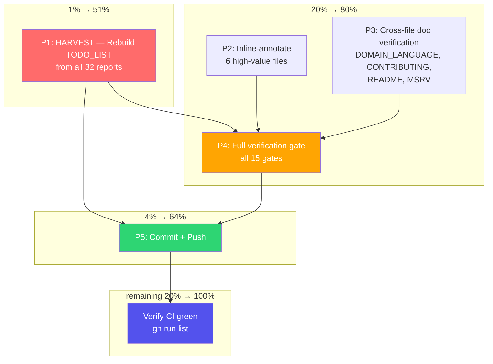

# Pareto Plan: Docs-Health Full Closure — Annotations, Harvest, Gate

**Date:** 2026-08-10 02:42 CEST
**Author:** Docs-health session (self-review driven)
**Status:** Planning — executing immediately after

---

## Context

The prior pass (02:37 CEST) read all 32 `2026-08-0*` files, verified living doc
counts against code, added CHANGELOG Documentation sub-entry, and archived all
32 files. But the self-review identified three critical gaps:

1. **HARVEST not done** — TODO_LIST has 7 items; the 32-report analysis surfaced
   10+ more genuinely open, bounded, actionable items. A "superb" TODO_LIST
   must capture these.
2. **Header-only annotations** — 7 files got resolution headers but NO inline
   strikethrough (the docs-health skill's #1 failure mode). 6 of those files
   have concrete numbered action items that are now done and should be marked
   inline.
3. **Full gate not run** — only 4 of 15 gates were executed.

This plan closes all three gaps, verifies cross-file doc consistency, and
commits the work with proper messages.

---

## Pareto Breakdown

### The 1% that delivers 51%

**HARVEST: Rebuild TODO_LIST.** The TODO_LIST is the single living doc that
drives all future work. Right now it has 7 items; the harvest from 32 reports
identified ~12 more genuinely open, bounded, actionable items. Without this,
the 32-file read produced annotations but no forward-looking value. The user
explicitly demanded "TODO_LIST.md must be SUPERB!"

### The 4% that delivers 64%

**HARVEST + commit all work.** Uncommitted work (36 changes) is invisible work.
The auto-git daemon will garbage-commit it if left alone. Committing with
proper messages delivers the entire session's output to the repo in a reviewable
form.

### The 20% that delivers 80%

The above **plus inline annotations on the 6 high-value archived files** and
**cross-file doc verification**. The 6 files have concrete numbered action items
(release steps, test items, bug fixes) that are now done — a reader scanning
them sees no markers. Inline strikethrough with commit hashes is the
docs-health skill's mandatory standard. Cross-file verification catches any
remaining drift in DOMAIN_LANGUAGE, CONTRIBUTING, README, and MSRV.

### The remaining 20% (to reach 100%)

**Full verification gate (all 15 gates) + push + CI check.** The recurring
process debt across 10+ sessions. No session has run the full gate
end-to-end. This session will.

---

## Phase 1: Comprehensive Plan (30–100 min tasks)

Sorted by impact, then effort within impact tier.

| ID  | Task                                                                                      | Impact      | Effort | Category     | Dependencies |
| --- | ----------------------------------------------------------------------------------------- | ----------- | ------ | ------------ | ------------ |
| P1  | **HARVEST: Rebuild TODO_LIST** from all 32 report findings, verify each item against code | 🔴 Critical | 40min  | Living docs  | None         |
| P2  | **Inline-annotate 6 high-value archived files** (concrete action items → strikethrough)   | 🟠 High     | 60min  | Annotation   | None         |
| P3  | **Cross-file doc verification** (DOMAIN_LANGUAGE, CONTRIBUTING, README, MSRV)             | 🟡 Medium   | 25min  | Consistency  | None         |
| P4  | **Run full verification gate** (all 15 gates via `scripts/verify-gate.sh`)                 | 🔴 Critical | 20min  | Verification | P1, P2, P3   |
| P5  | **Commit all work** with proper messages + push + verify CI green                          | 🟠 High     | 15min  | Git          | P4           |

**Total estimated effort:** ~160 min (2h 40min)

---

## Phase 2: Micro-Task Breakdown (max 12 min each)

### P1 — HARVEST: Rebuild TODO_LIST (40min)

| ID    | Micro-task                                                                         | Effort | Depends on |
| ----- | ---------------------------------------------------------------------------------- | ------ | ---------- |
| P1.1  | Compile candidate item list from 4 agent outputs (all 32 reports)                  | 8min   | —          |
| P1.2  | Filter: drop resolved, drop aspirational/"consider", keep bounded + actionable     | 8min   | P1.1       |
| P1.3  | Verify each candidate against code (`grep` for presence/absence of feature/test)   | 10min  | P1.2       |
| P1.4  | Deduplicate against existing 7 TODO_LIST items                                     | 5min   | P1.3       |
| P1.5  | Write the new TODO_LIST — all items grouped by category, with source citations      | 12min  | P1.4       |
| P1.6  | Route any long-term items to ROADMAP; verify FEATURES.md "Planned" section         | 5min    | P1.5       |

### P2 — Inline-annotate 6 archived files (60min)

| ID    | Micro-task                                                                         | Effort | Depends on |
| ----- | ---------------------------------------------------------------------------------- | ------ | ---------- |
| P2.1  | Annotate `02-48_v0-5-5-release-ready` — inline on release steps (f.1–f.10)         | 10min  | —          |
| P2.2  | Annotate `01-53_percentile-test-coverage` — 3 TODO items (f.5, f.6, f.7)           | 7min   | —          |
| P2.3  | Annotate `03-51_batch-or-interval-min-review` — version decision, property test    | 10min  | —          |
| P2.4  | Annotate `04-38_flaky-test-elimination` — release prep items                       | 10min  | —          |
| P2.5  | Annotate `04-50_v0-5-4-release-execution` — release steps, publish.yml fix         | 10min  | —          |
| P2.6  | Annotate `15-23_consistency-model-property-tests` — scan-cache TOCTOU items        | 10min  | —          |

### P3 — Cross-file doc verification (25min)

| ID    | Micro-task                                                                         | Effort | Depends on |
| ----- | ---------------------------------------------------------------------------------- | ------ | ---------- |
| P3.1  | Verify `docs/DOMAIN_LANGUAGE.md` consistency-model section vs shipped code         | 8min   | —          |
| P3.2  | Verify `CONTRIBUTING.md` lint-architecture section vs `Cargo.toml [lints.clippy]`  | 8min   | —          |
| P3.3  | Verify `README.md` version badges, Mermaid diagram, feature list                   | 8min   | —          |
| P3.4  | Verify `docs/MSRV.md` headline matches `Cargo.toml rust-version`                   | 5min   | —          |

### P4 — Full verification gate (20min)

| ID    | Micro-task                                                                         | Effort | Depends on |
| ----- | ---------------------------------------------------------------------------------- | ------ | ---------- |
| P4.1  | Run `scripts/verify-gate.sh` (all 15 gates, captures real exit codes)              | 20min  | P1–P3      |

### P5 — Commit + push (15min)

| ID    | Micro-task                                                                         | Effort | Depends on |
| ----- | ---------------------------------------------------------------------------------- | ------ | ---------- |
| P5.1  | `git status` — confirm all changes staged correctly                                | 2min   | P4         |
| P5.2  | Stage logical commit groups (docs changes / annotation / archive moves)            | 5min   | P5.1       |
| P5.3  | Write detailed commit message(s)                                                   | 5min   | P5.2       |
| P5.4  | `git commit` + `git push origin master`                                             | 3min   | P5.3       |

---

## Execution Graph

---

## Annotation Strategy (Smart, not mechanical)

**NOT every numbered item gets a strikethrough.** The docs-health skill says
inline is mandatory, but the SMART application distinguishes:

| File type                        | Treatment                                                        |
| -------------------------------- | ---------------------------------------------------------------- |
| Concrete action items (must-do)  | `~~item~~ done at <hash>` — inline strikethrough with evidence  |
| Concrete action items (should-do) | `~~item~~ done at <hash>` or `~~item~~ Won't implement — <reason>` |
| Brainstorm ("consider", "maybe") | Leave untouched — header states "brainstorm, see TODO_LIST"      |
| Open questions                   | Leave untouched — absence of marker IS the "open" signal         |

This prevents Verschlimmbesserung: mechanically striking 360 aspirational
items across 32 files is noise, not value.
