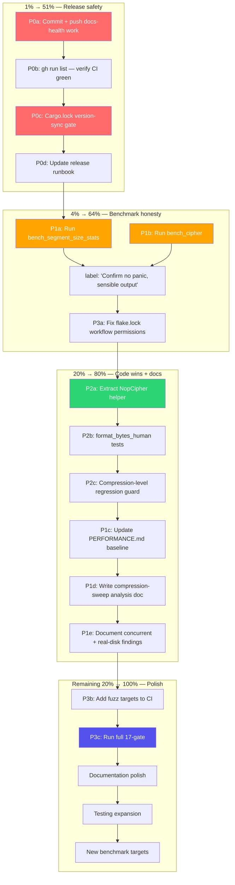

# Pareto Plan: Post-v0.6.0 Docs-Health + Code Quality + CI Hardening

**Date:** 2026-08-11 05:12 CEST
**Author:** Crush docs-health + planning session
**Status:** ✅ EXECUTED 2026-08-11 — all phases P0–P6 complete, 18/18 gates green
**Current release:** v0.6.0 (DurabilityPolicy default = `Throughput`, compression default = level 1)

---

## Context

This plan covers ALL open work identified across:
- The rebuilt `TODO_LIST.md` (11 items)
- The `docs/status/2026-08-11_04-23_*` status report § f (50 items)
- Resolved questions from the docs-health sweep (3 items → all answered)

**3 questions resolved autonomously:**
1. **July planning docs** → Leave as living reference (3 of 7 are actively linked from ROADMAP/TODO_LIST as design rationale). Do NOT archive.
2. **Stale [0.5.6] test counts** → Leave. Released entries are append-only. Counts were accurate at release time.
3. **Glob vs full filenames in TODO_LIST** → Full filenames (done — all citations rewritten this session).

---

## Pareto Breakdown

### The 1% that delivers 51%

**Commit + push + CI verify + Cargo.lock version-sync gate.**

The docs-health work is uncommitted (13 files). Without committing, the auto-git daemon will produce a garbage commit. The Cargo.lock version-sync gate prevents the #1 release failure that occurred twice (v0.5.7 publish failed, v0.5.6 era near-miss). This is a 30-minute script that eliminates an entire class of release bug forever.

### The 4% that delivers 64%

**Above + run the never-run benchmarks + fix flake.lock workflow.**

`bench_segment_size_stats` and `bench_cipher` ship in a published crate (v0.5.6+) but have **never been executed** — not even once. This is an integrity gap. The flake.lock workflow fails every Monday with 403 — it's weekly CI noise that erodes trust in the green-CI signal.

### The 20% that delivers 80%

**Above + quick code wins + benchmark documentation + release runbook fix.**

Extract `NopCipher` (3× duplication), add `format_bytes_human` edge-case tests, add compression-level regression guard, write compression-sweep analysis doc, update PERFORMANCE.md baseline, update release runbook with Cargo.lock sync step. All are bounded, high-value, zero-risk changes.

### The remaining 20% (to reach 100%)

**Polish, CI hardening, new benchmarks, documentation depth, long-term architecture.**

PartialEq for BufferStats, Hash impls, FEATURES.md split, LIMITATIONS.md status tags, DOMAIN_LANGUAGE.md updates, new benchmark targets (iter_from, concurrent_read, mixed read/write, flush), cross-platform filesystem tests, shellcheck in devShell, slug source-of-truth unification, and the long-term ROADMAP items (envelope v2, streaming cipher, async I/O).

---

## Phase 1: Comprehensive Plan (30–100 min tasks)

Sorted by impact × customer-value, then effort within tier.

| ID  | Task                                                                                  | Impact      | Effort  | Customer Value | Category     |
| --- | ------------------------------------------------------------------------------------- | ----------- | ------- | -------------- | ------------ |
|     | **— P0: RELEASE SAFETY (must-do before next release tag) —**                          |             |         |                |              |
| P0a | **Commit + push docs-health work** (13 files: TODO_LIST rebuild, annotations, archive moves, FEATURES/AGENTS updates) | 🔴 Critical | 10min   | Internal       | Process      |
| P0b | **Run `gh run list --limit 4`** — verify CI green after push                          | 🔴 Critical | 2min    | Internal       | Process      |
| P0c | **Add Cargo.lock version-sync gate to `verify-gate.sh`** — new gate that asserts Cargo.lock's `segment-buffer` version matches Cargo.toml | 🔴 Critical | 30min   | Release safety | CI           |
| P0d | **Update release runbook** — add `cargo check` (Cargo.lock sync) + `cargo publish --dry-run --features encryption` to step 3 | 🔴 Critical | 20min   | Release safety | Process      |
|     | **— P1: BENCHMARK HONESTY (shipped but never verified) —**                            |             |         |                |              |
| P1a | **Run `bench_segment_size_stats`** at least once — confirm it produces sensible output | 🟠 High     | 15min   | Integrity      | Benchmark    |
| P1b | **Run `bench_cipher --features encryption`** at least once — confirm output           | 🟠 High     | 15min   | Integrity      | Benchmark    |
| P1c | **Update `docs/PERFORMANCE.md` baseline snapshot** — re-run under level-1 default, replace stale v0.5.6/level-3 numbers | 🟠 High     | 45min   | User-facing    | Documentation |
| P1d | **Write `docs/perf/2026-08-10_compression-level-sweep.md` analysis doc** — accompany the TSV with conclusions | 🟡 Medium   | 30min   | User-facing    | Documentation |
| P1e | **Document concurrent-append + real-disk findings** in PERFORMANCE.md — append_all 3.6× advantage, CPU-bound finding | 🟡 Medium   | 20min   | User-facing    | Documentation |
|     | **— P2: QUICK CODE WINS (high value, low effort, zero risk) —**                      |             |         |                |              |
| P2a | **Extract `NopCipher` test helper** — duplicated 3× in `src/tests.rs`                 | 🟡 Medium   | 12min   | Code quality   | Code         |
| P2b | **`format_bytes_human` edge-case unit tests** — 0, 1023, 1024, 1025, u64::MAX         | 🟡 Medium   | 12min   | Correctness    | Testing      |
| P2c | **Compression-level default regression guard** — assert `default().compression_level == 1` | 🟢 Low      | 5min    | Correctness    | Testing      |
|     | **— P3: CI / PROCESS HARDENING —**                                                   |             |         |                |              |
| P3a | **Fix `update-flake-lock.yml` permissions** — add `contents: write` + `pull-requests: write` or disable schedule | 🟠 High     | 10min   | CI hygiene     | CI           |
| P3b | **Add remaining 5 fuzz targets to CI fuzz workflow** — or implement daily/weekly rotation | 🟡 Medium   | 30min   | Coverage       | CI           |
| P3c | **Run full 17-gate `verify-gate.sh`** — this session ran only 4 gates                 | 🟡 Medium   | 40min   | Internal       | Process      |
|     | **— P4: DOCUMENTATION POLISH —**                                                     |             |         |                |              |
| P4a | **Verify AGENTS.md "Durability model" section** reads coherently after v0.6.0 flip     | 🟡 Medium   | 15min   | Internal       | Documentation |
| P4b | **Split FEATURES.md unit-test cell** — 2000+ chars in one table cell is unreadable    | 🟢 Low      | 20min   | User-facing    | Documentation |
| P4c | **Add "Status" column to LIMITATIONS.md** — Permanent / Roadmap / Tradeoff             | 🟢 Low      | 20min   | User-facing    | Documentation |
| P4d | **Update `docs/DOMAIN_LANGUAGE.md`** with compression-level default change + PartialEq semantics | 🟢 Low      | 15min   | User-facing    | Documentation |
|     | **— P5: TESTING EXPANSION (deeper coverage) —**                                      |             |         |                |              |
| P5a | **Add `PartialEq` for `BufferStats`** — all fields are Copy, derive works directly     | 🟢 Low      | 10min   | Code quality   | Code         |
| P5b | **Add cross-platform filesystem semantics test module** — document unlink/mtime differences | 🟡 Medium   | 45min   | Correctness    | Testing      |
| P5c | **Add `flock` released on `Drop` test** — open second buffer after dropping first      | 🟢 Low      | 12min   | Correctness    | Testing      |
|     | **— P6: NEW BENCHMARK TARGETS —**                                                     |             |         |                |              |
| P6a | **`bench_iter_from`** — compare materialising iterator vs for_each_from vs read_from   | 🟢 Low      | 30min   | Performance    | Benchmark    |
| P6b | **`bench_flush`** — the encode pipeline is the hot path, not just append               | 🟢 Low      | 30min   | Performance    | Benchmark    |
| P6c | **`bench_concurrent_read`** — multiple reader threads calling read_from simultaneously | 🟢 Low      | 30min   | Performance    | Benchmark    |
| P6d | **Mixed read/write benchmark** — producer + consumer concurrently (cloud-sync workload) | 🟢 Low      | 40min   | Performance    | Benchmark    |
| P6e | **Realistic-payload variants in criterion micro-benchmarks** — text/json, not just uniform | 🟡 Medium   | 45min   | Honesty        | Benchmark    |
|     | **— D: DEFERRED (long-term, tracked in ROADMAP.md) —**                               |             |         |                |              |
| D1  | Envelope v2 design (streaming CBOR, Blake3 checksum, compression negotiation, cipher auto-detection) | 🔴 Critical | Days    | User-facing    | Architecture |
| D2  | Streaming/incremental cipher (RFC 8450 chunked format)                                | 🟠 High     | Days    | User-facing    | Architecture |
| D3  | Second `SegmentStore` impl (S3-backed, encrypted-block-device)                        | 🟡 Medium   | Days    | User-facing    | Architecture |
| D4  | Async I/O exploration (tokio / async-std feature)                                     | 🟡 Medium   | Days    | User-facing    | Architecture |
| D5  | Nightly benchmark CI workflow                                                         | 🟢 Low      | 60min   | Internal       | CI           |
| D6  | jscpd duplication gate in CI                                                          | 🟢 Low      | 30min   | Internal       | CI           |
| D7  | `FlushPolicy::validate()` Result-returning variant for release-mode                   | 🟢 Low      | 30min   | Code quality   | Code         |
| D8  | `ByteSize(u64)` newtype — promote `format_bytes_human` to public API                  | 🟢 Low      | 30min   | Code quality   | Code         |
| D9  | `Hash` for `FlushPolicy` + `DurabilityPolicy`                                         | 🟢 Low      | 15min   | Code quality   | Code         |
| D10 | BatchOrIntervalMin as the new default FlushPolicy                                     | 🟡 Medium   | 30min   | User-facing    | Architecture |

---

## Phase 2: Micro-Task Breakdown (max 12 min each)

### P0 — Release Safety

| ID     | Micro-task                                                                          | Effort | Depends on |
| ------ | ----------------------------------------------------------------------------------- | ------ | ---------- |
| P0a.1  | `git add -A && git commit` with descriptive message                                 | 3min   | —          |
| P0a.2  | `git push origin master`                                                            | 2min   | P0a.1      |
| P0b.1  | `gh run list --limit 4` — verify CI green                                           | 2min   | P0a.2      |
| P0c.1  | Write `scripts/check-cargo-lock-version.sh` — extract version from Cargo.toml, extract segment-buffer version from Cargo.lock, assert equal | 8min   | —          |
| P0c.2  | Add `cargo-lock-version` gate to `verify-gate.sh` with `should_run` wrapper + slug in `--list` + known list | 4min   | P0c.1      |
| P0c.3  | Test: `verify-gate.sh --only=cargo-lock-version` passes                             | 2min   | P0c.2      |
| P0d.1  | Edit AGENTS.md release runbook step 3 — add `cargo check` + `cargo publish --dry-run --features encryption` | 8min   | —          |
| P0d.2  | Verify the runbook reads coherently top-to-bottom                                    | 4min   | P0d.1      |

### P1 — Benchmark Honesty

| ID     | Micro-task                                                                          | Effort | Depends on |
| ------ | ----------------------------------------------------------------------------------- | ------ | ---------- |
| P1a.1  | `cargo bench --bench bench_segment_size_stats -- --quick` (or `--sample-size 10`)  | 10min  | —          |
| P1a.2  | Verify output is sensible (numbers produced, no panic)                              | 2min   | P1a.1      |
| P1b.1  | `cargo bench --bench bench_cipher --features encryption -- --quick`                | 10min  | —          |
| P1b.2  | Verify output is sensible                                                           | 2min   | P1b.1      |
| P1c.1  | Run all 11 criterion benchmarks with `--features encryption` (reduced sample size) | 30min  | —          |
| P1c.2  | Replace PERFORMANCE.md baseline snapshot numbers with new measurements              | 10min  | P1c.1      |
| P1c.3  | Update baseline header: "v0.5.6, level 3" → "v0.6.0, level 1"                       | 2min   | P1c.2      |
| P1d.1  | Read `docs/perf/2026-08-10_compression-level-sweep.tsv` to understand data         | 5min   | —          |
| P1d.2  | Write `docs/perf/2026-08-10_compression-level-sweep.md` with analysis + conclusion  | 20min  | P1d.1      |
| P1e.1  | Add "Concurrent append" section to PERFORMANCE.md with the 3.6× finding + table     | 8min   | —          |
| P1e.2  | Add "Real-disk vs tmpfs" section to PERFORMANCE.md with CPU-bound finding           | 8min   | —          |

### P2 — Quick Code Wins

| ID     | Micro-task                                                                          | Effort | Depends on |
| ------ | ----------------------------------------------------------------------------------- | ------ | ---------- |
| P2a.1  | Read `src/tests.rs` lines 1356–1412 to understand the 3 NopCipher duplications      | 3min   | —          |
| P2a.2  | Extract shared `NopCipher` struct + impl at top of the test module                  | 5min   | P2a.1      |
| P2a.3  | Remove the 3 inline duplicates, verify `cargo test` still passes                     | 4min   | P2a.2      |
| P2b.1  | Add `format_bytes_human` edge-case tests (0, 1023, 1024, 1025, u64::MAX)            | 10min  | —          |
| P2b.2  | `cargo test` verify new tests pass                                                  | 2min   | P2b.1      |
| P2c.1  | Add `compression_level_default_is_one` test to `src/tests.rs`                       | 3min   | —          |
| P2c.2  | `cargo test` verify                                                                  | 2min   | P2c.1      |

### P3 — CI / Process Hardening

| ID     | Micro-task                                                                          | Effort | Depends on |
| ------ | ----------------------------------------------------------------------------------- | ------ | ---------- |
| P3a.1  | Read `.github/workflows/update-flake-lock.yml` to understand current permissions    | 3min   | —          |
| P3a.2  | Add `permissions: contents: write, pull-requests: write` to the workflow             | 5min   | P3a.1      |
| P3a.3  | `actionlint` on the modified file                                                   | 2min   | P3a.2      |
| P3b.1  | Read `.github/workflows/fuzz.yml` to understand current matrix                       | 3min   | —          |
| P3b.2  | Decide: add all 7 targets or implement daily/weekly rotation split                   | 5min   | P3b.1      |
| P3b.3  | Update fuzz.yml matrix with all (or rotated) targets                                 | 8min   | P3b.2      |
| P3b.4  | `actionlint` on the modified file                                                   | 2min   | P3b.3      |
| P3c.1  | Run `scripts/verify-gate.sh` (full 17-gate + cargo-lock-version = 18)               | 40min  | P0c.2      |

### P4 — Documentation Polish

| ID     | Micro-task                                                                          | Effort | Depends on |
| ------ | ----------------------------------------------------------------------------------- | ------ | ---------- |
| P4a.1  | Read AGENTS.md "Durability model" section top-to-bottom                              | 5min   | —          |
| P4a.2  | Fix any contradictions (pre-v0.6.0 language, stale "today's default" references)    | 8min   | P4a.1      |
| P4b.1  | Extract FEATURES.md unit-test cell to a "Test coverage" section below the table     | 12min  | —          |
| P4b.2  | Replace the table cell with a concise summary + link to the new section             | 5min   | P4b.1      |
| P4c.1  | Add "Status" column to LIMITATIONS.md (Permanent / Roadmap / Tradeoff)               | 12min  | —          |
| P4d.1  | Update DOMAIN_LANGUAGE.md compression-level default (3→1) if not already done        | 5min   | —          |
| P4d.2  | Add SegmentConfig PartialEq semantics (pointer identity for cipher) to DOMAIN_LANGUAGE | 8min   | —          |

### P5 — Testing Expansion

| ID     | Micro-task                                                                          | Effort | Depends on |
| ------ | ----------------------------------------------------------------------------------- | ------ | ---------- |
| P5a.1  | Add `#[derive(PartialEq, Eq)]` to `BufferStats` (all fields are Copy)                | 3min   | —          |
| P5a.2  | Add test verifying BufferStats equality semantics                                    | 5min   | P5a.1      |
| P5a.3  | `cargo test` verify                                                                  | 2min   | P5a.2      |
| P5b.1  | Create `tests/cross_platform_fs.rs` with platform-documentation headers              | 12min  | —          |
| P5b.2  | Add macOS `unlink` non-exclusivity test (cfg-gated or property-based)                | 12min  | P5b.1      |
| P5c.1  | Add `flock_released_on_drop` test — open buffer, drop, open same dir again            | 10min  | —          |

### P6 — New Benchmark Targets

| ID     | Micro-task                                                                          | Effort | Depends on |
| ------ | ----------------------------------------------------------------------------------- | ------ | ---------- |
| P6a.1  | Write `benches/bench_iter_from.rs` (compare iter_from vs for_each_from vs read_from) | 12min  | —          |
| P6a.2  | Register in `Cargo.toml`, compile-check, clippy-clean                                | 5min   | P6a.1      |
| P6b.1  | Write `benches/bench_flush.rs` (isolate the encode pipeline)                         | 12min  | —          |
| P6b.2  | Register in `Cargo.toml`, compile-check, clippy-clean                                | 5min   | P6b.1      |
| P6c.1  | Write `benches/bench_concurrent_read.rs` (multi-reader throughput)                   | 12min  | —          |
| P6c.2  | Register in `Cargo.toml`, compile-check, clippy-clean                                | 5min   | P6c.1      |
| P6d.1  | Write `benches/bench_mixed_read_write.rs` (producer + consumer concurrent)           | 12min  | —          |
| P6d.2  | Register in `Cargo.toml`, compile-check, clippy-clean                                | 5min   | P6d.1      |
| P6e.1  | Add text/json payload variants to `benches/support.rs`                               | 12min  | —          |
| P6e.2  | Add `bench_append_realistic` target using text payloads                              | 12min  | P6e.1      |

---

## Execution Graph

---

## Anti-Verschlimmbesserung Checklist

Each phase must satisfy these before execution:

- [ ] **Zero behavior change** unless the task explicitly calls for one (only P0c, P3a, P3b change behavior)
- [ ] **No hot-path modification** — P2 tasks touch test code only, not library code
- [ ] **No new dependency** — all tasks use existing toolchain
- [ ] **No on-disk format change** — no segment.rs or store.rs modifications
- [ ] **No API signature change** — P5a adds a derive, not a signature change
- [ ] **Commit after each phase group**, not at the end — the auto-git daemon's timer is shorter than any phase
- [ ] **Run `cargo test` after each code change** — not just at the end
- [ ] **Run `gh run list` after pushing** — CI green is the source of truth, not local green

---

## Session Execution Order

1. **P0a–P0b** (commit + push + CI verify) — 12min
2. **P0c–P0d** (Cargo.lock gate + runbook) — 50min
3. **P1a–P1b** (run never-run benchmarks) — 30min
4. **P3a** (fix flake.lock) — 10min
5. **P2a–P2c** (quick code wins) — 30min
6. **P1c–P1e** (PERFORMANCE.md updates) — 90min
7. **P3b** (fuzz CI) — 30min
8. **P3c** (full gate) — 40min
9. **P4a–P4d** (doc polish) — 60min
10. **P5a–P5c** (testing expansion) — 70min
11. **P6a–P6e** (new benchmarks) — 90min

**Total estimated effort:** ~8 hours of focused work. Items 1–6 (the 80%) are ~3.5 hours.
