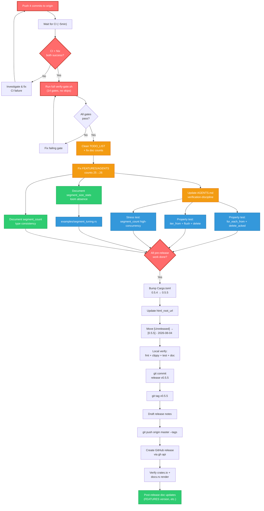

# Pareto Plan: segment-buffer v0.5.5 Release + Cleanup

**Date:** 2026-08-04 01:53
**Author:** docs-health + update-old-docs session (second pass)
**Status:** ~~Planning — awaiting user approval before execution~~ **FULLY EXECUTED.**

> **Resolution (2026-08-10):** Every Phase 1 task (P1.1–P1.13) in this plan was
> executed. v0.5.5 was released on 2026-08-04 (tag `v0.5.5`, commit `8e2bcbf`),
> published to crates.io and docs.rs. All testing gaps (P1.8, P1.9, P1.12) were
> closed; `examples/segment_tuning.rs` (P1.7) shipped; all doc-count corrections
> (P1.4, P1.5) landed; the AGENTS.md verification-discipline update (P1.6)
> shipped. The TODO_LIST was rebuilt with 7 genuinely open, bounded items.
> **Archived.**

---

## Context

The `[Unreleased]` section of CHANGELOG.md has **44 entries** spanning 5 major
deliverables (panic-free API, `segment_size_stats`, scan-cache TOCTOU fix, live
`segment_count`, strict Clippy architecture) plus dozens of testing, docs, and
tooling improvements. None of this is available to users — the last release
(v0.5.4) was 2026-08-02. The crate sits at version `0.5.4` with 4 unpushed
commits on master, CI green.

The TODO_LIST has 3 `[x]` completed items (trophy-case pattern — the daemon
shipped the percentile tests but nobody removed them from TODO_LIST). Two
genuine open items remain. FEATURES.md and AGENTS.md have stale property-test
counts (25, actual 26). The verify-gate.sh `run()` bug (silent exit-0 on
failure) was fixed but AGENTS.md doesn't document it.

This plan covers: release the accumulated work, clean the doc drift, close the
remaining testing gaps, and verify everything.

---

## Pareto Breakdown

### The 1% that delivers 51%

**Push to origin + verify CI green.**

4 commits are local/unpushed. CI has never validated the combined work of all
2026-08-04 sessions. Until CI sees the code, every "green" claim is local-only.
This is the single highest-leverage action — it unblocks everything downstream
(release, CI confidence, merge confidence).

### The 4% that delivers 64%

**Release v0.5.5.**

The `[Unreleased]` section is the largest in the project's history (44 entries).
Releasing delivers all accumulated value to users: the panic-free API (the
biggest quality improvement since extraction), `segment_size_stats` (the tuning
primitive), the scan-cache TOCTOU fix (a correctness fix), live `segment_count`
(an observability primitive), and the strict Clippy architecture (a
maintainability guarantee). No API signature changes are breaking; all new
fields are `#[non_exhaustive]`. This is a minor version bump (0.5.4 → 0.5.5).

### The 20% that delivers 80%

1. **Release v0.5.5** (above)
2. **Clean TODO_LIST trophy-case** — remove 3 `[x]` items, leaving only genuine
   open work. A trophy-case TODO_LIST is worse than no TODO_LIST because it
   trains readers to ignore the file.
3. **Fix stale doc counts** — FEATURES.md and AGENTS.md say 25 property tests
   (actual 26). One-line fixes, but they're the most-read claims in the docs.
4. **Run the full verify-gate.sh end-to-end** — no session in the 2026-08-04
   sequence has run all 14 gates. The `run()` bug that masked failures is now
   fixed. This is the first release that can actually trust the gate.
5. **Push + verify CI** (above)

### The other 20% (to reach 100%)

6. **Close testing gaps** — `for_each_from` under concurrent `delete_acked`,
   `iter_from` concurrent property test, `segment_count` high-concurrency
   stress test. These are correctness-proving tests for the panic-free API
   that just shipped — the new snapshot pattern is the riskiest change.
7. **`examples/segment_tuning.rs`** — the `segment_size_stats` feature has no
   runnable example. The feature's _entire purpose_ (tuning) is undocumented
   in executable form.
8. **AGENTS.md verification-discipline update** — the section still describes
   pre-fix gate behavior. Future sessions will be confused.
9. **Document the `segment_size_stats` loom-absence rationale** — prevents a
   future agent from "fixing" a non-gap.
10. **`segment_count` type consistency decision** — `u64` vs `usize` across
    `BufferStats` and `RecoveryReport`. Low effort to document, prevents
    confusion.

---

## Phase 1: Comprehensive Plan (30–100 min tasks)

Sorted by importance/impact/effort/customer-value.

| #     | Task                                                                                                                                                           | Impact      | Effort | Category     | Dependencies                  |
| ----- | -------------------------------------------------------------------------------------------------------------------------------------------------------------- | ----------- | ------ | ------------ | ----------------------------- |
| P1.1  | **Push 4 unpushed commits to origin, verify CI green**                                                                                                         | 🔴 Critical | 5min   | Verification | None — first action           |
| P1.2  | **Run full `scripts/verify-gate.sh` end-to-end** (all 14 gates, no `--no-*` skips except changelog-links if rate-limited)                                      | 🔴 Critical | 10min  | Verification | P1.1 (CI must be green first) |
| P1.3  | **Release v0.5.5** — bump Cargo.toml version, update html_root_url, move CHANGELOG `[Unreleased]` → `[0.5.5]`, commit, tag, push, create GitHub release        | 🔴 Critical | 30min  | Release      | P1.1, P1.2                    |
| P1.4  | **Clean TODO_LIST trophy-case** — remove 3 `[x]` items, update counts, verify only genuine open items remain                                                   | 🟠 High     | 10min  | Docs cleanup | None                          |
| P1.5  | **Fix stale doc counts** — FEATURES.md + AGENTS.md property tests 25→26, any other count drift                                                                 | 🟠 High     | 5min   | Docs cleanup | P1.4 (same pass)              |
| P1.6  | **AGENTS.md verification-discipline update** — document `set -euo pipefail`, `run()` rewrite, gate behavior                                                    | 🟠 High     | 20min  | Docs cleanup | None                          |
| P1.7  | **`examples/segment_tuning.rs`** — runnable demo showing `segment_size_stats()` used to adjust `FlushPolicy::Batch(N)`                                         | 🟡 Medium   | 30min  | Feature gap  | None                          |
| P1.8  | **Testing gap: `for_each_from` under concurrent `delete_acked`** — property test mirroring the flush-race test through the lending iterator's delete code path | 🟡 Medium   | 30min  | Testing      | None                          |
| P1.9  | **Testing gap: `iter_from` under concurrent flush + delete** — property test for the materialising iterator's Phase 1/Phase 2 gap                              | 🟡 Medium   | 30min  | Testing      | None                          |
| P1.10 | **Document `segment_size_stats` loom-absence** — comment in `tests/loom.rs` or AGENTS.md explaining why it's absent (pure query, no mutex surface)             | 🟢 Low      | 5min   | Docs cleanup | None                          |
| P1.11 | **`segment_count` type consistency decision** — document or reconcile `u64` vs `usize` across `BufferStats` and `RecoveryReport`                               | 🟢 Low      | 10min  | Design       | None                          |
| P1.12 | **Stress test: `segment_count` under high-concurrency** — 4+ thread stress test complementing the loom proof                                                   | 🟢 Low      | 20min  | Testing      | None                          |
| P1.13 | **Post-release: update all doc references** — FEATURES.md "current release is v0.5.5", README badges, any version-specific claims                              | 🟡 Medium   | 15min  | Release      | P1.3                          |

---

## Phase 2: Micro-Tasks (≤12 min each)

Each Phase 1 task broken into independently-verifiable steps.

### P1.1 — Push + CI verify (5min)

| #    | Micro-task                                                            | Verifiable how?                         |
| ---- | --------------------------------------------------------------------- | --------------------------------------- |
| 1.1a | `git status` — confirm clean tree, count unpushed commits             | `git log --oneline origin/master..HEAD` |
| 1.1b | `git push origin master`                                              | Push succeeds                           |
| 1.1c | Wait ~5min, `gh run list --limit 4` — confirm both CI + Nix `success` | `gh run list` shows green               |

### P1.2 — Full verify-gate.sh (10min)

| #    | Micro-task                                                                                         | Verifiable how?                |
| ---- | -------------------------------------------------------------------------------------------------- | ------------------------------ |
| 2.1a | Run `scripts/verify-gate.sh` (no `--no-*` flags except `--no-changelog-links` if API rate-limited) | Exit code 0, "ALL GATES GREEN" |
| 2.2a | If loom gate passes: confirm 12 tests in output                                                    | Loom output shows "12 passed"  |
| 2.3a | If supply-chain passes: note `cargo audit` + `cargo deny` results in commit message                | Exit code 0                    |

### P1.3 — Release v0.5.5 (30min)

| #     | Micro-task                                                                                                     | Verifiable how?                            |
| ----- | -------------------------------------------------------------------------------------------------------------- | ------------------------------------------ |
| 3.1a  | Verify CI is green on the commit to be tagged: `gh run list --limit 4`                                         | Both workflows `success`                   |
| 3.2a  | Bump `Cargo.toml` version: `0.5.4` → `0.5.5`                                                                   | `grep '^version' Cargo.toml` shows `0.5.5` |
| 3.3a  | Update `html_root_url` in `src/lib.rs`: `0.5.4` → `0.5.5`                                                      | `grep html_root_url src/lib.rs` matches    |
| 3.4a  | Move CHANGELOG `[Unreleased]` entries under `## [0.5.5] - 2026-08-04`                                          | Section header exists with today's date    |
| 3.5a  | Add CHANGELOG compare link at bottom: `[0.5.5]: https://github.com/.../compare/v0.5.4...v0.5.5`                | Link resolves                              |
| 3.6a  | Create new empty `[Unreleased]` section above `[0.5.5]`                                                        | Section exists, empty                      |
| 3.7a  | `cargo fmt --all -- --check`                                                                                   | Clean                                      |
| 3.8a  | `cargo clippy --all-targets --features encryption -- -D warnings`                                              | 0 warnings                                 |
| 3.9a  | `cargo test --no-fail-fast --features encryption`                                                              | All pass                                   |
| 3.10a | `cargo doc --no-deps --features encryption`                                                                    | Clean                                      |
| 3.11a | `git commit -am "release v0.5.5"`                                                                              | Commit exists                              |
| 3.12a | `git tag v0.5.5` (lightweight)                                                                                 | `git tag` lists `v0.5.5`                   |
| 3.13a | Draft release notes from CHANGELOG `[0.5.5]` section                                                           | Notes file ready                           |
| 3.14a | `git push origin master --tags`                                                                                | Push succeeds                              |
| 3.15a | Create GitHub release: `gh api --method POST repos/LarsArtmann/segment-buffer/releases -f tag_name=v0.5.5 ...` | Release URL resolves                       |
| 3.16a | Verify crates.io publishes via `publish.yml` workflow auto-trigger                                             | `gh run list` shows publish workflow       |
| 3.17a | Verify `https://crates.io/crates/segment-buffer/0.5.5` renders within 5min                                     | Page exists                                |

### P1.4 + P1.5 — TODO_LIST cleanup + doc counts (15min)

| #    | Micro-task                                                                                                                                    | Verifiable how?             |
| ---- | --------------------------------------------------------------------------------------------------------------------------------------------- | --------------------------- |
| 4.1a | Remove 3 `[x]` items from TODO_LIST (percentile parametrized test, edge-case test, encrypted segment_size_stats test — all shipped by daemon) | TODO_LIST has 0 `[x]` items |
| 4.2a | Update FEATURES.md property test count: 25 → 26 (add `percentile_of_sorted_matches_nearest_rank_for_all_pct` to description)                  | Count matches `grep -c`     |
| 4.3a | Update AGENTS.md property test count: 25 → 26                                                                                                 | Count matches `grep -c`     |
| 4.4a | Update FEATURES.md unit test count if changed (currently 109 in FEATURES, actual 115 — check if daemon added tests)                           | Count matches `grep -c`     |
| 4.5a | Update AGENTS.md unit test count if changed                                                                                                   | Count matches `grep -c`     |

### P1.6 — AGENTS.md verification-discipline update (20min)

| #    | Micro-task                                                                                                                                                          | Verifiable how?                    |
| ---- | ------------------------------------------------------------------------------------------------------------------------------------------------------------------- | ---------------------------------- |
| 6.1a | Read current verification-discipline rules section (rules 4–6)                                                                                                      | Understand current text            |
| 6.2a | Add note to rule 4: verify-gate.sh now uses `set -euo pipefail` and the `run()` function was rewritten to capture real exit status (was silently exit-0 on failure) | New text present                   |
| 6.3a | Update the "local gate" description to mention all 14 gates by name                                                                                                 | Gate list matches `verify-gate.sh` |
| 6.4a | Verify no other AGENTS.md claims are stale (loom count, test counts, lint description)                                                                              | `grep` for stale numbers           |

### P1.7 — `examples/segment_tuning.rs` (30min)

| #    | Micro-task                                                                                                                                                                            | Verifiable how?           |
| ---- | ------------------------------------------------------------------------------------------------------------------------------------------------------------------------------------- | ------------------------- |
| 7.1a | Study existing examples for pattern (`basic_usage.rs`, `backpressure.rs`)                                                                                                             | Understand the convention |
| 7.2a | Write `examples/segment_tuning.rs`: open buffer, append items, flush, call `segment_size_stats()`, print distribution, demonstrate adjusting `FlushPolicy::Batch(N)` based on p50/max | File compiles             |
| 7.3a | `cargo run --example segment_tuning` — verify output is sensible                                                                                                                      | Runs without error        |
| 7.4a | Add to FEATURES.md examples row + CHANGELOG if not already unreleased                                                                                                                 | Doc updated               |
| 7.5a | `cargo clippy --all-targets -- -D warnings` on the new example                                                                                                                        | 0 warnings                |

### P1.8 — `for_each_from` under concurrent `delete_acked` (30min)

| #    | Micro-task                                                                                                                       | Verifiable how?        |
| ---- | -------------------------------------------------------------------------------------------------------------------------------- | ---------------------- |
| 8.1a | Study existing `for_each_from_invariant_under_concurrent_flush` in `src/property_tests.rs`                                       | Understand the pattern |
| 8.2a | Write `for_each_from_invariant_under_concurrent_delete_acked`: reader via `for_each_from`, concurrent deleter via `delete_acked` | Test compiles          |
| 8.3a | Run `cargo test --features encryption for_each_from_invariant_under_concurrent_delete`                                           | Passes                 |
| 8.4a | Update FEATURES.md + AGENTS.md + CHANGELOG if count changes                                                                      | Counts match           |

### P1.9 — `iter_from` under concurrent flush + delete (30min)

| #    | Micro-task                                                                  | Verifiable how?        |
| ---- | --------------------------------------------------------------------------- | ---------------------- |
| 9.1a | Study existing concurrent property tests                                    | Understand the pattern |
| 9.2a | Write `iter_from_invariant_under_concurrent_flush_and_delete`               | Test compiles          |
| 9.3a | Run `cargo test --features encryption iter_from_invariant_under_concurrent` | Passes                 |
| 9.4a | Update doc counts                                                           | Counts match           |

### P1.10 — Document segment_size_stats loom-absence (5min)

| #     | Micro-task                                                                                                                                                                                  | Verifiable how? |
| ----- | ------------------------------------------------------------------------------------------------------------------------------------------------------------------------------------------- | --------------- |
| 10.1a | Add a comment in `tests/loom.rs` (near the module doc) explaining why `segment_size_stats` is absent: pure query, no mutex concurrency surface, reuses already-covered `scan_segments` path | Comment exists  |

### P1.11 — segment_count type consistency (10min)

| #     | Micro-task                                                                                            | Verifiable how? |
| ----- | ----------------------------------------------------------------------------------------------------- | --------------- |
| 11.1a | Document the `u64` vs `usize` inconsistency in the `segment_count` field doc comment on `BufferStats` | Comment exists  |
| 11.2a | Remove the item from TODO_LIST (resolved as "documented, not reconciled")                             | Item removed    |

### P1.12 — segment_count high-concurrency stress test (20min)

| #     | Micro-task                                                                                                                                                        | Verifiable how?        |
| ----- | ----------------------------------------------------------------------------------------------------------------------------------------------------------------- | ---------------------- |
| 12.1a | Write `segment_count_stress_4_writers_2_deleters`: 4 threads appending+flushing, 2 threads deleting, assert `segment_count` never panics and converges after join | Test compiles + passes |
| 12.2a | Use `FlushPolicy::Manual` (Rule 7)                                                                                                                                | Policy is Manual       |

### P1.13 — Post-release doc updates (15min)

| #     | Micro-task                                                                 | Verifiable how?    |
| ----- | -------------------------------------------------------------------------- | ------------------ |
| 13.1a | Update FEATURES.md versioning note: "current release is v0.5.5"            | Text matches       |
| 13.2a | Update any README badges or version references                             | Matches Cargo.toml |
| 13.3a | Run `scripts/check-msrv.sh` to verify MSRV consistency across all surfaces | Exit code 0        |

---

## Execution Graph (Mermaid)

---

## What is explicitly NOT in this plan (anti-Verschlimmbesserung)

These items were considered and rejected to prevent well-intentioned damage:

1. **No Cargo.toml lint edits.** BuildFlow manages `unchecked_time_subtraction`.
   A feedback file is filed. Editing the line manually races the daemon. Leave it.
2. **No `health()` primitive.** DEFER decision — all 3 designs are
   Verschlimmbessern. In ROADMAP non-goals. Do not un-defer.
3. **No background flush worker.** Rejected by design. Caller-owned
   `FlushPolicy::Manual` + timer thread is the pattern.
4. **No envelope v2.** Long-term format change. In ROADMAP. Not actionable yet.
5. **No async I/O.** Long-term. In ROADMAP. No consumer.
6. **No streaming cipher.** Long-term (RFC 8450). In ROADMAP. v0.6+.
7. **No cursor file.** Rejected — consumer's concern. See AGENTS.md.
8. **No `Arc<Vec<T>>` snapshot for for_each_from.** Perf investigation, not a
   bug. The tradeoff (panic-free vs ~21× faster) is documented. v0.6+ if a
   consumer reports the regression matters.
9. **No rewrite of historical status reports.** They are annotated (backward
   resolution via `update-old-docs`), not rewritten. History is preserved.
10. **No empty-message commit cleanup.** The auto-commit daemon produces them.
    5+ sessions have noticed. It's a daemon config issue, not a code issue.

---

## Risk Assessment

| Risk                                          | Likelihood | Impact                                 | Mitigation                                                                                                                                                                                                       |
| --------------------------------------------- | ---------- | -------------------------------------- | ---------------------------------------------------------------------------------------------------------------------------------------------------------------------------------------------------------------- |
| CI fails after push (MSRV lint)               | Medium     | High (blocks release)                  | BuildFlow manages the lint line; CI passes on stable; the `msrv` CI job runs `cargo check` not `cargo clippy`, so the unknown-lint error may not surface. If it does, the fix is in the BuildFlow feedback file. |
| Loom suite takes >4min                        | Low        | Low (just slow)                        | Acceptable; CI runs it once per push                                                                                                                                                                             |
| `changelog-links` rate-limited                | High       | Low (skip with `--no-changelog-links`) | Already handled by the gate's skip flag                                                                                                                                                                          |
| Release tag push triggers publish.yml failure | Low        | Medium (crates.io publish fails)       | `publish.yml` is now idempotent (queries crates.io before publishing); safe to re-run                                                                                                                            |
| Property test reveals a concurrency bug       | Very Low   | High (blocks release)                  | The panic-free API is loom-proven and stress-tested; a property test finding a bug would be a _good_ outcome (ship the fix, then release)                                                                        |
